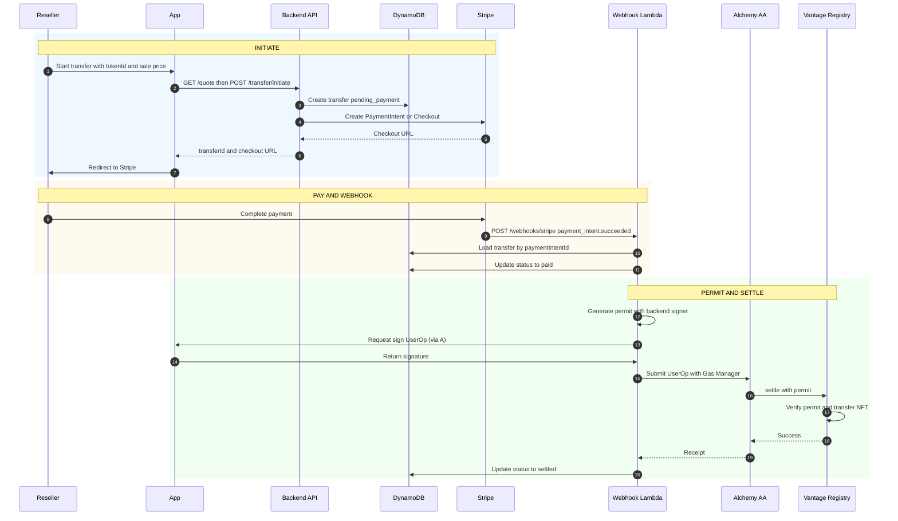

# Solution C: Settlement Orchestration

**Vantage Settlement Protocol — Build Independently, Combine Later**  
**Scope:** Quote API, Stripe payment, permit generation, on-chain settlement (Lambda + DynamoDB + EventBridge)  
**Depends on:** Solution A (identity, signing, NFT data), Solution B (contract address, ABI, permit format)  
**Reference:** [vantage-technical-spec.md](../vantage-technical-spec.md)

---

## Purpose

Solution C is the **settlement orchestration** layer: it computes the exit tax (royalty), collects payment from the reseller via Stripe, generates the cryptographic permit, and triggers the on-chain `settle()` call. It uses Lambda + DynamoDB + EventBridge (no Step Functions). It depends on A for auth, user addresses, and (optionally) NFT data for holding period; and on B for the contract and permit format.

---

## Sequence Flow

End-to-end: initiate, pay, webhook, permit, settle. Depends on A for signing and NFT data, B for contract.

---

## Tech Stack

| Component | Technology | Purpose |
|-----------|------------|---------|
| **Orchestration** | Lambda + DynamoDB + EventBridge | Webhook-triggered settlement; scheduled timeout for unpaid transfers |
| **Backend API** | Node.js/Lambda + API Gateway | Quote, initiate, status |
| **Payment** | Stripe | Fiat payment for reseller exit tax (immediate capture) |
| **Permit signer** | Backend key (e.g. ethers Wallet) | ECDSA signature for contract |
| **Chain** | Alchemy AA (RPC + Bundler + Gas Manager) | Submit `settle()` UserOp |

---

## Deliverables

1. **API**
   - `GET /quote?tokenId=...&salePrice=...` — returns royalty amount (uses holding period from A or Alchemy NFT API)
   - `POST /transfer/initiate` — create transfer in DynamoDB (`pending_payment`), create Stripe Checkout Session or PaymentIntent, return checkout URL
   - `GET /transfer/:id/status` — return transfer status

2. **Stripe webhook** `POST /webhooks/stripe` (e.g. `payment_intent.succeeded`):
   - Load transfer by `paymentIntentId`
   - Set status `paid`
   - Generate permit (same format as B)
   - Call `settle()` via Alchemy AA (request Magic signature from frontend if needed; retry 3x with backoff)
   - On success: set `settled`; on permanent failure: set `settlement_failed` and trigger Stripe refund

3. **EventBridge schedule** (e.g. every 10 min) + **Timeout Lambda**:
   - Query DynamoDB for `status = pending_payment` and `createdAt` older than 10 min
   - Set `status = timed_out`

4. **DynamoDB:** Transfer table with at least: `transferId`, `status`, `paymentIntentId`, `resellerId`, `tokenId`, `collectorAddress`, `declaredSalePrice`, `royaltyAmount`, `createdAt`, `permit`, `txHash`

---

## Interfaces (What C Consumes)

### From A (Identity & Wallet)

- **Auth:** Validate DIDToken; get reseller/collector `publicAddress` (and Smart Account if AA)
- **Signing:** Request "sign this UserOp" for `settle()`; receive signature and submit via Alchemy Bundler
- **NFT data:** Holding period for royalty — C calls Alchemy NFT API (or A's API) with owner and contract address to get last transfer date

### From B (Chain)

- **Contract address** and **ABI**
- **Permit format:** `keccak256(abi.encodePacked(transferId, from, to, tokenId, salePrice))` signed by backend; contract expects this and `COMPLIANCE_SIGNER`

---

## Flow Summary

1. Reseller initiates → C creates transfer (`pending_payment`) and Stripe session → returns checkout URL
2. Reseller pays → Stripe webhook → C sets `paid`, generates permit, calls settle (3x retry) → sets `settled` or `settlement_failed` (refund if failed)
3. EventBridge + Timeout Lambda → mark old `pending_payment` as `timed_out`

---

## Royalty Logic (Time-Based Tiers)

- Holding period from chain (Alchemy NFT API or A)
- &lt; 1 year: 10%; 1–3 years: 5%; &gt; 3 years: 2%
- `royaltyAmount = declaredSalePrice * tierRate`

---

## Acceptance Criteria

- [ ] Quote returns correct royalty for a given token and sale price (with mocked or real holding period)
- [ ] Initiate creates transfer and Stripe session; redirect to checkout
- [ ] On payment success webhook: permit generated, settle() called; transfer status `settled` and NFT moves on-chain (or `settlement_failed` + refund on permanent failure)
- [ ] Timeout Lambda marks stale `pending_payment` as `timed_out`
- [ ] Idempotency / duplicate webhook handling (e.g. by transfer status or idempotency key)

---

## When Combined With A and B

- Frontend uses A for login and "My Vault"; when C needs to run settle, frontend uses A (Magic) to sign UserOp; C submits via Alchemy AA
- C uses B's deployed contract address and ABI; C's permit signer matches B's `COMPLIANCE_SIGNER`
- Full flow: Reseller pays exit tax → C captures payment and generates permit → C triggers settle (gas sponsored) → Collector receives NFT
