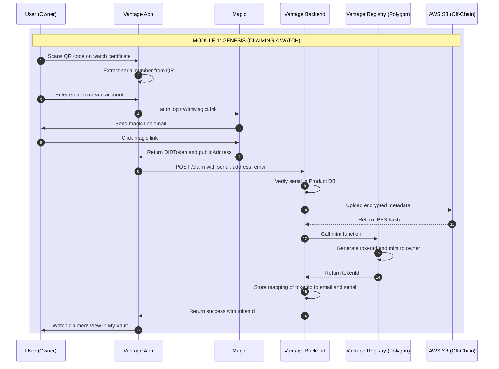
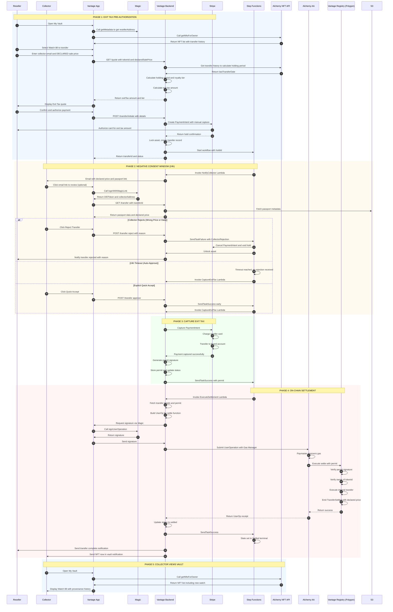

# Vantage Settlement Protocol: Technical Specification

**Project:** White-label Asset Governance Platform  
**Version:** 1.0 (Dev Ready)  
**Date:** February 2, 2026  
**Status:** MVP - Ready for Implementation

---

## Executive Summary

Vantage is a **Sovereign Smart Contract** platform that handles **Issuance** (minting) and **Restricted Settlement** (compliance-gated resales) of digital passports for luxury assets. Unlike a marketplace, Vantage is a **governance layer** that sits on top of any sales channel (eBay, Chrono24, private sales, etc.) to enforce brand rules on NFT transfers.

**The Model:** Physical assets are sold anywhere. When ownership changes, the reseller pays an Exit Tax (royalty) to transfer the digital passport (NFT) to the new owner. The protocol uses a **"Negative Consent"** model where collectors have 24 hours to verify the declared sale price before the transfer auto-completes.

**Key Characteristics:**
- **Not a Marketplace:** Physical sales happen outside Vantage (any channel)
- **Sovereign Contract:** Brand owns the ERC-721 registry (no platform dependencies)
- **Exit Tax Model:** Current owner pays royalty via Stripe to unlock NFT transfer
- **Negative Consent:** Collectors verify declared price; 24h auto-approve if no rejection
- **Dynamic Tiers:** Royalty rate adjusts based on holding duration (configurable for brand convenience)
- **Transfer Locks:** Minimum holding period prevents premature resale (anti-flip mechanism)
- **Provenance Protection:** Declared sale prices become permanent on-chain record
- **GDPR Compliant:** Twin data structure (on-chain state + off-chain PII)
- **Chain Agnostic:** Polygon (public) with compatibility for private networks (Aura/Quorum)
- **Orchestrated Workflow:** AWS Step Functions manages long-running, human-in-the-loop processes

---

## System Architecture

### Technology Stack

| Component | Technology | Purpose |
|-----------|-----------|---------|
| **Auth & Wallet** | Magic (magic.link) | Passwordless login, embedded wallets, signing |
| **Account Abstraction** | Alchemy AA (ERC-4337) | Gasless transactions, smart contract accounts |
| **NFT Indexing** | Alchemy NFT API | Query ownership, transfer history, holding period |
| **Workflow Engine** | AWS Step Functions | Orchestrate async flows with timeouts and callbacks |
| **Backend API** | Node.js/Lambda + DynamoDB | Royalty calculator, compliance gate, permit generation |
| **Payment Gateway** | Stripe | Fiat payment processing for royalties |
| **Blockchain** | Polygon (EVM) | NFT registry, settlement execution |
| **Smart Contract** | Solidity (ERC-721 + 2981) | Sovereign asset registry with permit-gated transfers |

---

## Core Components

### 1. Magic (Identity & Wallet)
**What it does:**
- Passwordless authentication via email magic links
- Embedded, non-custodial wallets (users don't manage private keys)
- Returns `publicAddress` for blockchain operations and `DIDToken` for backend auth

**Integration points:**
- User login → Magic returns address
- Transaction signing → Magic signs UserOp or standard transaction
- Backend validates DIDToken to ensure authenticated user

**Dev notes:**
```javascript
// Frontend: Magic SDK
const magic = new Magic('pk_live_...');
const didToken = await magic.auth.loginWithMagicLink({ email });
const metadata = await magic.user.getMetadata(); // { publicAddress, email }

// Backend: Validate DIDToken
const { publicAddress, email } = await magic.token.validate(didToken);
```

### 2. Alchemy Account Abstraction (Gasless Transactions)
**What it does:**
- Smart Contract Accounts (SCAs) via ERC-4337
- Paymaster sponsors gas fees (brand pays, not user)
- Bundler submits UserOperations to chain

**Integration points:**
- Magic wallet = signer/owner of the Smart Account
- Vantage Backend builds UserOp → Magic signs → Alchemy Bundler submits
- Gas Manager policy: sponsor only `settle()` calls on Vantage contract

**Dev notes:**
```javascript
// Backend: Build UserOp for settlement
const userOp = {
  sender: smartAccountAddress, // SCA controlled by Magic wallet
  nonce: await entryPoint.getNonce(smartAccountAddress),
  callData: vantageContract.interface.encodeFunctionData('settle', [from, to, tokenId, permit]),
  paymasterAndData: '0x...' // Alchemy Gas Manager
};

// Request Magic signature
const signature = await magic.wallet.signUserOperation(userOp);

// Submit to Alchemy Bundler
await alchemyAA.sendUserOperation(userOp, signature);
```

### 3. Alchemy NFT API (Ownership & History)
**What it does:**
- Query NFTs by owner address
- Fetch transfer history and timestamps
- Calculate holding period for royalty tiers

**Integration points:**
- "My Vault" UI: List user's NFTs
- Royalty calculation: Fetch `lastTransferDate` to compute holding period

**Dev notes:**
```javascript
// Get user's NFTs
const nfts = await alchemy.nft.getNftsForOwner(ownerAddress, {
  contractAddresses: [VANTAGE_CONTRACT_ADDRESS]
});

// Get transfer history for holding period
const transfers = await alchemy.nft.getTransfersForOwner(ownerAddress, {
  contractAddresses: [VANTAGE_CONTRACT_ADDRESS]
});
const lastTransfer = transfers[0]; // Most recent
const holdingPeriodDays = (Date.now() - lastTransfer.metadata.blockTimestamp * 1000) / (1000 * 60 * 60 * 24);
```

### 4. AWS Step Functions (Orchestration)
**What it does:**
- Manages async workflows with "Negative Consent" model
- Callback pattern with task tokens for external events
- **Critical:** Timeout = Success (auto-approve), not failure
- Compensation logic for explicit rejections

**Workflow states:**
1. `AuthorizeExitTax` (create Stripe hold on reseller's card)
2. `CollectorReviewWindow` (24h for collector to verify/reject)
   - Timeout (24h) → Auto-approve (capture payment & settle)
   - Explicit rejection → Void hold & unlock asset
3. `CaptureExitTax` (capture Stripe hold from reseller)
4. `SettleOnChain` (execute on-chain transfer with permit)
5. `Settled` (terminal success) or `Cancelled` (terminal failure)

**Integration points:**
- Backend API calls `StartExecution` with transfer data
- Reseller authorizes Stripe hold (pre-auth, not captured)
- Collector can call `SendTaskFailure` to reject (within 24h)
- Timeout triggers auto-capture → settlement (normal flow)

**Dev notes:**
```json
{
  "Comment": "Vantage Exit Tax & Transfer Workflow (Negative Consent)",
  "StartAt": "AuthorizeExitTax",
  "States": {
    "AuthorizeExitTax": {
      "Type": "Task",
      "Resource": "arn:aws:lambda:invoke",
      "Parameters": {
        "FunctionName": "CreateStripeHold",
        "Payload": {
          "reseller.$": "$.resellerId",
          "royaltyAmount.$": "$.royaltyAmount",
          "transferId.$": "$.transferId"
        }
      },
      "ResultPath": "$.stripeHoldId",
      "Next": "CollectorReviewWindow"
    },
    "CollectorReviewWindow": {
      "Type": "Task",
      "Resource": "arn:aws:states:::lambda:invoke.waitForTaskToken",
      "Parameters": {
        "FunctionName": "NotifyCollector",
        "Payload": {
          "taskToken.$": "$$.Task.Token",
          "transferId.$": "$.transferId",
          "declaredSalePrice.$": "$.declaredSalePrice"
        }
      },
      "TimeoutSeconds": 86400,
      "Catch": [
        {
          "ErrorEquals": ["States.Timeout"],
          "ResultPath": "$.timeoutInfo",
          "Next": "CaptureExitTax"
        },
        {
          "ErrorEquals": ["CollectorRejection"],
          "ResultPath": "$.rejection",
          "Next": "VoidHoldAndUnlock"
        }
      ],
      "Next": "CaptureExitTax"
    },
    "CaptureExitTax": {
      "Type": "Task",
      "Resource": "arn:aws:lambda:invoke",
      "Parameters": {
        "FunctionName": "CaptureStripePayment",
        "Payload": {
          "holdId.$": "$.stripeHoldId"
        }
      },
      "Next": "GeneratePermit"
    },
    "GeneratePermit": {
      "Type": "Task",
      "Resource": "arn:aws:lambda:invoke",
      "Parameters": {
        "FunctionName": "GenerateTransferPermit",
        "Payload.$": "$"
      },
      "ResultPath": "$.permit",
      "Next": "SettleOnChain"
    },
    "SettleOnChain": {
      "Type": "Task",
      "Resource": "arn:aws:lambda:invoke",
      "Parameters": {
        "FunctionName": "ExecuteBlockchainSettlement",
        "Payload.$": "$"
      },
      "Next": "Settled"
    },
    "VoidHoldAndUnlock": {
      "Type": "Parallel",
      "Branches": [
        {
          "StartAt": "VoidStripeHold",
          "States": {
            "VoidStripeHold": {
              "Type": "Task",
              "Resource": "arn:aws:lambda:invoke",
              "Parameters": {
                "FunctionName": "VoidStripeHold",
                "Payload": {
                  "holdId.$": "$.stripeHoldId"
                }
              },
              "End": true
            }
          }
        },
        {
          "StartAt": "UnlockAsset",
          "States": {
            "UnlockAsset": {
              "Type": "Task",
              "Resource": "arn:aws:lambda:invoke",
              "Parameters": {
                "FunctionName": "UnlockAsset",
                "Payload": {
                  "tokenId.$": "$.tokenId"
                }
              },
              "End": true
            }
          }
        }
      ],
      "Next": "Cancelled"
    },
    "Settled": {
      "Type": "Succeed"
    },
    "Cancelled": {
      "Type": "Succeed"
    }
  }
}
```

### 5. Vantage Backend (Compliance Gate & Royalty Engine)
**What it does:**
- **Royalty Calculator:** Computes Exit Tax based on holding period and declared sale price
- **Stripe Integration:** Creates pre-authorization holds (manual capture) for reseller exit tax
- **Compliance Gate:** Validates payment, declared price, and generates cryptographic permit
- **Permit:** ECDSA signature proving exit tax was paid and collector had opportunity to verify
- **Provenance Guardian:** Stores declared sale prices as permanent on-chain record

**Royalty Logic (Time-Based Tiers):**
```javascript
function calculateRoyalty(salePrice, holdingPeriodDays) {
  let tierRate;
  if (holdingPeriodDays < 365) {
    tierRate = 0.10; // 10% - Short-term holding
  } else if (holdingPeriodDays < 1095) {
    tierRate = 0.05; // 5% - Standard
  } else {
    tierRate = 0.02; // 2% - Long-term holding
  }
  return salePrice * tierRate;
}
```

**Permit Generation (Backend Signer):**
```javascript
const ethers = require('ethers');

// Backend has a private key for signing permits
const backendWallet = new ethers.Wallet(BACKEND_PRIVATE_KEY);

async function generatePermit(transferId, from, to, tokenId, salePrice) {
  const message = ethers.utils.solidityKeccak256(
    ['uint256', 'address', 'address', 'uint256', 'uint256'],
    [transferId, from, to, tokenId, salePrice]
  );
  const signature = await backendWallet.signMessage(ethers.utils.arrayify(message));
  return signature; // 0x... bytes
}
```

**API Endpoints:**
- `GET /quote?tokenId=88&salePrice=5000` → Returns royalty amount
- `POST /transfer/initiate` → Starts Step Functions workflow
- `POST /transfer/:id/approve` → Collector accepts (sends task success)
- `POST /webhooks/stripe` → Payment confirmation (sends task success + generates permit)
- `POST /transfer/:id/settle` → Executes on-chain settlement with permit

### 6. Vantage Contract (Sovereign ERC-721)
**What it does:**
- Standard ERC-721 NFT contract
- Overrides `transferFrom` to block direct transfers
- Exposes `settle(permit)` function requiring backend-signed permit
- Verifies permit signature before executing transfer

**Contract code:**
```solidity
// SPDX-License-Identifier: MIT
pragma solidity ^0.8.20;

import "@openzeppelin/contracts/token/ERC721/ERC721.sol";
import "@openzeppelin/contracts/token/common/ERC2981.sol";
import "@openzeppelin/contracts/utils/cryptography/ECDSA.sol";

contract VantageAssetRegistry is ERC721, ERC2981 {
    using ECDSA for bytes32;
    
    address public immutable COMPLIANCE_SIGNER; // Backend public key
    uint256 private _tokenIdCounter;
    
    mapping(uint256 => string) private _metadataHashes; // IPFS CID for off-chain data
    
    constructor(address complianceSigner) ERC721("Brand Asset Registry", "BASSET") {
        COMPLIANCE_SIGNER = complianceSigner;
    }
    
    // GENESIS: Mint when user claims watch
    function mint(address to, string memory metadataHash) external onlyOwner returns (uint256) {
        uint256 tokenId = ++_tokenIdCounter;
        _mint(to, tokenId);
        _metadataHashes[tokenId] = metadataHash;
        return tokenId;
    }
    
    // BLOCK DIRECT TRANSFERS
    function transferFrom(address from, address to, uint256 tokenId) public override {
        revert("Direct transfers disabled. Use settle() with permit.");
    }
    
    function safeTransferFrom(address from, address to, uint256 tokenId, bytes memory data) public override {
        revert("Direct transfers disabled. Use settle() with permit.");
    }
    
    // SETTLEMENT: Only path for secondary transfers
    function settle(
        uint256 transferId,
        address from,
        address to,
        uint256 tokenId,
        uint256 salePrice,
        bytes memory permit
    ) external {
        require(ownerOf(tokenId) == from, "From address is not owner");
        
        // Verify backend signed this transfer (proving royalty paid)
        bytes32 message = keccak256(abi.encodePacked(transferId, from, to, tokenId, salePrice));
        bytes32 ethSignedMessage = message.toEthSignedMessageHash();
        address signer = ethSignedMessage.recover(permit);
        
        require(signer == COMPLIANCE_SIGNER, "Invalid permit - royalty not paid");
        
        // Execute transfer (internal, bypasses override)
        _transfer(from, to, tokenId);
        
        emit TransferSettled(transferId, tokenId, from, to, salePrice);
    }
    
    event TransferSettled(uint256 indexed transferId, uint256 indexed tokenId, address from, address to, uint256 salePrice);
}
```

---

## Data Architecture (GDPR "Twin" Model)

To ensure GDPR compliance, data is strictly separated:

### On-Chain (Public/Pseudonymous)
**Storage:** Polygon blockchain  
**Content:**
- `tokenId` (watch identifier)
- `ownerAddress` (wallet address, no PII)
- `metadataHash` (IPFS CID pointing to encrypted off-chain data)
- `royaltyInfo` (ERC-2981 standard)
- `transferHistory` (timestamps, addresses)

**Privacy:** Public but pseudonymous. Addresses are not linked to identities on-chain.

### Off-Chain (Private/Encrypted)
**Storage:** AWS S3 + DynamoDB  
**Content:**
- Owner name, email, phone
- Watch details: serial number, high-res photos, warranty status
- Service history
- Transfer request details (pending, collector email)

**Privacy:** Encrypted at rest (AES-256), access controlled via IAM, linked to wallet address but never exposed on-chain.

**Linking mechanism:**
- `tokenURI(tokenId)` → returns IPFS hash
- IPFS content → encrypted JSON with reference to S3 bucket
- Backend decrypts and serves to authenticated user only

---

## Business Logic & Key Concepts

### Vantage is NOT a Marketplace

**Critical distinction:** Vantage does NOT facilitate the physical sale of assets. It is a **governance layer** that:
- Enforces brand rules on NFT transfers
- Collects royalties when ownership changes
- Maintains provenance records on-chain

**The physical transaction happens elsewhere:**
- eBay, Chrono24, private WhatsApp deals, in-person sales, etc.
- Collector may already physically possess the watch before the NFT transfer
- Payment for the watch happens outside Vantage (cash, Venmo, wire, etc.)

**Vantage only governs the digital twin (NFT):**
- Reseller initiates NFT transfer after selling the physical watch
- Reseller declares the sale price (for royalty calculation and provenance)
- Reseller pays exit tax (royalty) to unlock the transfer
- Collector verifies the declaration is accurate
- NFT transfers on-chain with permanent record of sale price

### The "Negative Consent" Model

**Why collector review matters (even though they're not paying):**

1. **Provenance Protection:**
   - Declared sale price becomes permanent on-chain record
   - If reseller lies ("I sold it for 1 CHF" to avoid tax), it pollutes asset history
   - Future buyers see false price data, affecting appraisals and insurance

2. **Tax Evasion Prevention:**
   - Reseller might under-declare to pay lower royalty
   - Collector has incentive to report honestly (correct valuation benefits their asset)
   - Example: Watch sold for 10,000 CHF, reseller declares 1,000 CHF → Collector rejects

3. **Fraud Detection:**
   - Reseller might over-declare to inflate asset value artificially
   - Collector rejects: "I only paid 2,000 CHF, not 8,000 CHF"
   - Prevents wash trading and price manipulation

4. **Data Integrity:**
   - Wrong serial number, mismatched photos, incorrect warranty status
   - Collector can reject if passport data doesn't match physical watch received

**How it works:**
```
Reseller: "I sold Watch #88 for 5,000 CHF to collector@example.com"
System: Creates Stripe hold for 500 CHF (10% royalty)
Collector: Receives email "Incoming NFT, declared value 5,000 CHF"

Option A (99% of cases): Collector does nothing → 24h passes → Auto-approve
Option B (fraud/error): Collector clicks "Reject - Wrong price" → Hold voided
Option C (fast track): Collector clicks "Quick Accept" → Immediate capture
```

**Benefits:**
- ✅ Low friction: Most transfers auto-complete
- ✅ Fraud protection: Collector can block false declarations
- ✅ Provenance integrity: On-chain records are trustworthy
- ✅ Brand revenue: Tax evasion is difficult

### The Exit Tax Calculation

**Inputs:**
- `declaredSalePrice` (what reseller claims they sold for)
- `holdingPeriod` (time reseller owned the asset, from blockchain)

**Logic:**
```javascript
function calculateExitTax(declaredSalePrice, holdingPeriodDays) {
  let tierRate;
  if (holdingPeriodDays < 365) {
    tierRate = 0.10; // 10% - Short-term holding
  } else if (holdingPeriodDays < 1095) {
    tierRate = 0.05; // 5% - Standard
  } else {
    tierRate = 0.02; // 2% - Long-term holding
  }
  return declaredSalePrice * tierRate;
}
```

**Example:**
- Watch held for 6 months (< 1 year) → 10% rate
- Declared sale: 5,000 CHF
- Exit tax: 500 CHF
- Reseller authorizes 500 CHF → Stripe hold
- After 24h (if no rejection) → Capture 500 CHF → Transfer NFT

---

## Complete Sequence Diagrams

### Flow 1: Genesis (Minting/Claiming)



### Flow 2: Settlement (Reselling with Exit Tax & Negative Consent)

**Context:** Physical watch was already sold outside Vantage (eBay, private sale, etc.). This flow only governs the NFT transfer and exit tax collection.



---

## Error Handling & Rollback

### Timeout Scenarios (Negative Consent Model)

| State | Timeout | Action |
|-------|---------|--------|
| `CollectorReviewWindow` | 24 hours | **Success:** Auto-approve, capture exit tax, proceed to settlement |
| `SettlementPending` | 5 minutes | Retry 3x, then manual intervention (payment already captured) |

**Note:** Unlike traditional flows, timeout in `CollectorReviewWindow` is the HAPPY PATH (auto-approve), not an error.

### Rejection Scenarios

**Collector explicitly rejects transfer:**
1. Collector clicks "Reject" with reason (wrong price, wrong asset, etc.)
2. Backend calls `SendTaskFailure(taskToken, "CollectorRejection")`
3. Step Functions → `VoidHoldAndUnlock` parallel branches:
   - Cancel Stripe PaymentIntent (void hold on reseller's card)
   - Unlock asset in database
4. Notify reseller: "Transfer rejected by collector - Reason: [price mismatch]"
5. Reseller can re-initiate with corrected information

**Reseller's card authorization fails:**
1. Stripe returns error on PaymentIntent creation
2. Backend returns 402 Payment Required to frontend
3. Prompt reseller: "Payment method declined. Update card and retry"
4. No Step Functions workflow started (pre-flight check)

**Reseller's card capture fails (after 24h):**
1. Stripe capture attempt fails (insufficient funds, card expired, etc.)
2. Backend calls `SendTaskFailure(taskToken, "CaptureFailure")`
3. Step Functions → `VoidHoldAndUnlock`
4. Notify reseller: "Payment capture failed. Transfer cancelled"
5. Notify collector: "Transfer cancelled - reseller payment issue"

**On-chain settlement fails:**
1. Contract reverts (e.g., invalid permit, asset already transferred)
2. UserOp fails, Alchemy returns error
3. Backend logs error, marks transfer as `failed`
4. **Critical:** Exit tax already captured → initiate Stripe refund to reseller
5. Notify both parties, manual review required

### Provenance Fraud Detection

**Scenario: Collector claims declared price is wrong**
1. Collector rejects with reason: "Declared 5000 CHF but I only paid 2000 CHF"
2. System logs rejection reason and both parties' info
3. Manual review: Check off-chain evidence (invoices, messages)
4. If fraud confirmed: Ban reseller, potential legal action
5. If collector lying: Note on collector's record (reputation system)

---

## Implementation Checklist

### Phase 1: Genesis (Claiming)
- [ ] Deploy Vantage Asset Registry contract to Polygon testnet
- [ ] Integrate Magic SDK (frontend + backend validation)
- [ ] Build `/claim` endpoint (verify serial, mint NFT)
- [ ] Set up S3 bucket for off-chain metadata (encrypted)
- [ ] QR code generation for watch certificates

### Phase 2: Settlement (Reselling)
- [ ] Integrate Alchemy NFT API (holding period calculation)
- [ ] Build royalty calculator with tier logic and declared price input
- [ ] Set up Stripe account with manual capture enabled
- [ ] Implement Stripe PaymentIntent creation (capture_method: manual)
- [ ] Implement Stripe capture and cancel/void logic
- [ ] Deploy Step Functions workflow with negative consent logic
- [ ] Implement permit generation (backend signer)
- [ ] Integrate Alchemy AA (Gas Manager setup)
- [ ] Build settlement Lambda (UserOp builder)
- [ ] Build collector notification email template with review link

### Phase 3: Frontend
- [ ] Magic login flow
- [ ] "My Vault" (list NFTs via Alchemy)
- [ ] Transfer initiation UI (collector email, DECLARED sale price)
- [ ] Exit tax quote display (show tier and amount)
- [ ] Reseller: Stripe card authorization UI (pre-auth, not capture)
- [ ] Collector review screen (passport data + declared price verification)
- [ ] Collector: Reject transfer modal (with reason selection)
- [ ] Collector: Quick Accept button (optional early approval)
- [ ] Status tracker (pending_review, approved, captured, settled, rejected)

### Phase 4: Testing
- [ ] Unit tests for royalty calculator
- [ ] Contract tests (permit verification, transfer blocking)
- [ ] Integration test: full flow on testnet
- [ ] Stripe test mode validation
- [ ] Step Functions timeout testing
- [ ] Gas Manager budget limits

---

## Configuration & Deployment

### Environment Variables
```bash
# Magic
MAGIC_PUBLISHABLE_KEY=pk_live_...
MAGIC_SECRET_KEY=sk_live_...

# Alchemy
ALCHEMY_API_KEY=...
ALCHEMY_POLICY_ID=... # Gas Manager policy
ALCHEMY_NETWORK=polygon-mainnet

# Stripe
STRIPE_SECRET_KEY=sk_live_...
STRIPE_WEBHOOK_SECRET=whsec_...

# Contract
VANTAGE_CONTRACT_ADDRESS=0x...
BACKEND_PRIVATE_KEY=0x... # For permit signing
COMPLIANCE_SIGNER_ADDRESS=0x... # Public key in contract

# AWS
AWS_REGION=us-east-1
STEP_FUNCTIONS_ARN=arn:aws:states:...
S3_BUCKET=le-passports-prod
```

### Contract Deployment
```bash
# 1. Deploy contract
npx hardhat run scripts/deploy.js --network polygon

# 2. Verify on Polygonscan
npx hardhat verify --network polygon <CONTRACT_ADDRESS> <BACKEND_ADDRESS>

# 3. Configure Alchemy Gas Manager
# - Add CONTRACT_ADDRESS to allowed contracts
# - Whitelist settle() function selector: 0x...
# - Set spending limit: 1000 MATIC/month

# 4. Fund Gas Manager paymaster
# - Transfer MATIC to paymaster address
```

---

## Security Considerations

### Smart Contract
- ✅ Only `settle()` can transfer (direct transfers blocked)
- ✅ Permit signature verification prevents replay attacks
- ✅ `transferId` in permit ensures single-use (backend tracks used IDs)
- ⚠️ Backend private key security: Use AWS KMS or HSM for production
- ⚠️ Rate limiting on mint() to prevent abuse

### Backend
- ✅ DIDToken validation for all authenticated endpoints
- ✅ Stripe webhook signature verification
- ✅ CORS configuration (only allow vantage.com)
- ⚠️ Step Functions execution throttling (prevent DoS)
- ⚠️ Database encryption for PII (email, name)

### GDPR
- ✅ Right to erasure: Delete off-chain data (on-chain remains pseudonymous)
- ✅ Data portability: Export user data via API
- ✅ Consent management: User agrees to T&C during claiming
- ⚠️ Data retention: Define policy for unclaimed watches

---

## FAQ for Developers

**Q: Is Vantage a marketplace? Where do physical sales happen?**  
A: No. Vantage is a **governance layer**, not a marketplace. Physical assets are sold anywhere (eBay, Chrono24, private sales, etc.). Vantage only governs the NFT transfer and collects exit tax when ownership changes.

**Q: Does the collector pay anything through Vantage?**  
A: No. The collector pays the reseller for the physical watch outside Vantage (cash, Venmo, wire, etc.). Only the reseller pays through Vantage (the exit tax/royalty).

**Q: Why does the collector need to review if they're not paying?**  
A: To verify the declared sale price is accurate. If reseller under-declares ("I sold for 1 CHF" to avoid tax), collector can reject. This protects provenance integrity and prevents tax evasion.

**Q: What happens if the collector does nothing for 24 hours?**  
A: The transfer auto-approves (negative consent). This is the normal flow - collector only acts if something is wrong.

**Q: Why not use standard ERC-721 royalty enforcement?**  
A: ERC-2981 is advisory only. Marketplaces can ignore it. Vantage's `settle()` function makes payment **mandatory** before transfer.

**Q: Can users sell on OpenSea?**  
A: No. Direct transfers are blocked. They must use Vantage to transfer the NFT (physical sale can happen anywhere).

**Q: What if exit tax capture succeeds but on-chain transfer fails?**  
A: Backend initiates refund via Stripe API. Manual review logs the incident for reconciliation.

**Q: How do we handle chain congestion (high gas)?**  
A: Alchemy Gas Manager buffers volatility. For extreme cases, Step Functions can retry with exponential backoff.

**Q: Is the backend a single point of failure?**  
A: Yes, for permit generation. Mitigation: Deploy backend across multiple regions, use AWS KMS for key security, implement permit caching.

**Q: Can the brand switch providers later?**  
A: Yes. The contract is sovereign (brand owns it). They can:
  1. Deploy new backend with different permit signer
  2. Update `COMPLIANCE_SIGNER` in contract (via governance)
  3. Migrate orchestration to Temporal/Camunda if leaving AWS

**Q: What prevents a reseller from lying about the sale price?**  
A: The collector. If reseller under-declares, collector rejects (loses their royalty-inclusive valuation). If reseller over-declares, collector also rejects (false provenance). Both parties have aligned incentives for accuracy.

---

**End of Technical Specification**
