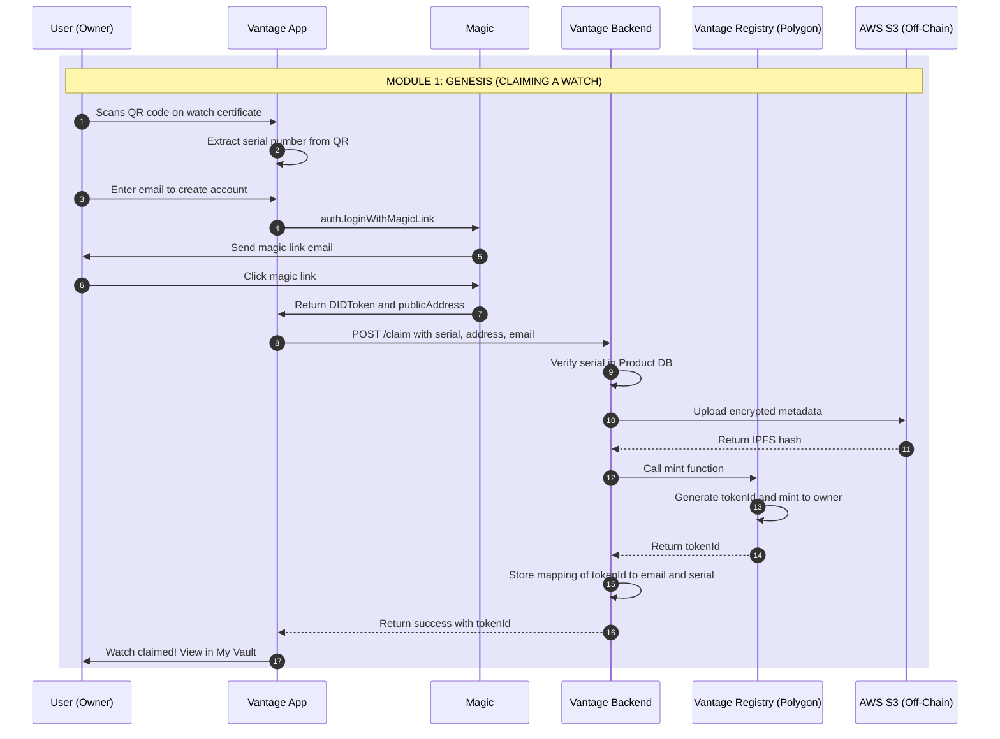
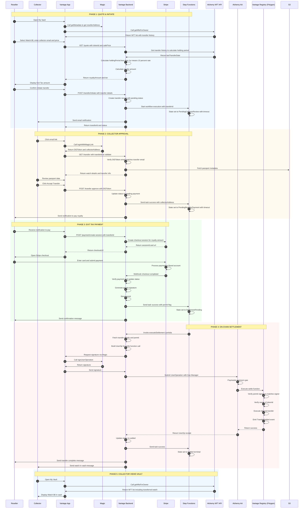

# Vantage Settlement Protocol: Technical Specification

**Project:** White-label Asset Governance Platform  
**Version:** 1.0 (Dev Ready)  
**Date:** February 2, 2026  
**Status:** MVP - Ready for Implementation

---

## Executive Summary

Vantage is a **Sovereign Smart Contract** platform that handles **Issuance** (minting) and **Restricted Settlement** (compliance-gated resales) of digital passports for luxury assets. The protocol implements a **"Pay-to-Transfer"** model where resellers must pay an Exit Tax (royalty) before the blockchain transfer executes.

**Key Characteristics:**
- **Sovereign Contract:** Brand owns the ERC-721 registry (no platform dependencies)
- **Reseller-Paid Royalties:** Current owner pays Exit Tax via Stripe to unlock transfer
- **Dynamic Tiers:** Royalty rate adjusts based on holding duration (configurable for brand convenience)
- **Transfer Locks:** Minimum holding period prevents premature resale (anti-flip mechanism)
- **GDPR Compliant:** Twin data structure (on-chain state + off-chain PII)
- **Chain Agnostic:** Polygon (public) with compatibility for private networks (Aura/Quorum)
- **Orchestrated Workflow:** AWS Step Functions manages long-running, human-in-the-loop processes

---

## System Architecture

### Technology Stack

| Component | Technology | Purpose |
|-----------|-----------|---------|
| **Auth & Wallet** | Magic (magic.link) | Passwordless login, embedded wallets, signing |
| **Account Abstraction** | Alchemy AA (ERC-4337) | Gasless transactions, smart contract accounts |
| **NFT Indexing** | Alchemy NFT API | Query ownership, transfer history, holding period |
| **Workflow Engine** | AWS Step Functions | Orchestrate async flows with timeouts and callbacks |
| **Backend API** | Node.js/Lambda + DynamoDB | Royalty calculator, compliance gate, permit generation |
| **Payment Gateway** | Stripe | Fiat payment processing for royalties |
| **Blockchain** | Polygon (EVM) | NFT registry, settlement execution |
| **Smart Contract** | Solidity (ERC-721 + 2981) | Sovereign asset registry with permit-gated transfers |

---

## Core Components

### 1. Magic (Identity & Wallet)
**What it does:**
- Passwordless authentication via email magic links
- Embedded, non-custodial wallets (users don't manage private keys)
- Returns `publicAddress` for blockchain operations and `DIDToken` for backend auth

**Integration points:**
- User login → Magic returns address
- Transaction signing → Magic signs UserOp or standard transaction
- Backend validates DIDToken to ensure authenticated user

**Dev notes:**
```javascript
// Frontend: Magic SDK
const magic = new Magic('pk_live_...');
const didToken = await magic.auth.loginWithMagicLink({ email });
const metadata = await magic.user.getMetadata(); // { publicAddress, email }

// Backend: Validate DIDToken
const { publicAddress, email } = await magic.token.validate(didToken);
```

### 2. Alchemy Account Abstraction (Gasless Transactions)
**What it does:**
- Smart Contract Accounts (SCAs) via ERC-4337
- Paymaster sponsors gas fees (brand pays, not user)
- Bundler submits UserOperations to chain

**Integration points:**
- Magic wallet = signer/owner of the Smart Account
- Vantage Backend builds UserOp → Magic signs → Alchemy Bundler submits
- Gas Manager policy: sponsor only `settle()` calls on Vantage contract

**Dev notes:**
```javascript
// Backend: Build UserOp for settlement
const userOp = {
  sender: smartAccountAddress, // SCA controlled by Magic wallet
  nonce: await entryPoint.getNonce(smartAccountAddress),
  callData: vantageContract.interface.encodeFunctionData('settle', [from, to, tokenId, permit]),
  paymasterAndData: '0x...' // Alchemy Gas Manager
};

// Request Magic signature
const signature = await magic.wallet.signUserOperation(userOp);

// Submit to Alchemy Bundler
await alchemyAA.sendUserOperation(userOp, signature);
```

### 3. Alchemy NFT API (Ownership & History)
**What it does:**
- Query NFTs by owner address
- Fetch transfer history and timestamps
- Calculate holding period for royalty tiers

**Integration points:**
- "My Vault" UI: List user's NFTs
- Royalty calculation: Fetch `lastTransferDate` to compute holding period

**Dev notes:**
```javascript
// Get user's NFTs
const nfts = await alchemy.nft.getNftsForOwner(ownerAddress, {
  contractAddresses: [VANTAGE_CONTRACT_ADDRESS]
});

// Get transfer history for holding period
const transfers = await alchemy.nft.getTransfersForOwner(ownerAddress, {
  contractAddresses: [VANTAGE_CONTRACT_ADDRESS]
});
const lastTransfer = transfers[0]; // Most recent
const holdingPeriodDays = (Date.now() - lastTransfer.metadata.blockTimestamp * 1000) / (1000 * 60 * 60 * 24);
```

### 4. AWS Step Functions (Orchestration)
**What it does:**
- Manages async workflows with human-in-the-loop (collector approval, payment)
- Callback pattern with task tokens for external events
- Timeouts and compensation logic (rollback on failure)

**Workflow states:**
1. `PendingCollectorReview` (wait for collector accept, 48h timeout)
2. `PendingResellerPayment` (wait for Stripe webhook, 24h timeout)
3. `SettlementPending` (execute on-chain transfer)
4. `Settled` (terminal success) or `Cancelled` (terminal failure)

**Integration points:**
- Backend API calls `StartExecution` with transfer data
- Stripe webhook calls `SendTaskSuccess(taskToken)` on payment
- Timeout triggers compensation Lambda (unlock asset, void payment)

**Dev notes:**
```json
{
  "Comment": "Vantage Transfer Workflow",
  "StartAt": "PendingCollectorReview",
  "States": {
    "PendingCollectorReview": {
      "Type": "Task",
      "Resource": "arn:aws:states:::lambda:invoke.waitForTaskToken",
      "Parameters": {
        "FunctionName": "SendCollectorEmail",
        "Payload": {
          "taskToken.$": "$$.Task.Token",
          "transferId.$": "$.transferId"
        }
      },
      "TimeoutSeconds": 172800,
      "Catch": [{ "ErrorEquals": ["States.Timeout"], "Next": "Cancelled" }],
      "Next": "PendingResellerPayment"
    },
    "PendingResellerPayment": {
      "Type": "Task",
      "Resource": "arn:aws:states:::lambda:invoke.waitForTaskToken",
      "HeartbeatSeconds": 300,
      "TimeoutSeconds": 86400,
      "Next": "SettlementPending"
    },
    "SettlementPending": {
      "Type": "Task",
      "Resource": "arn:aws:lambda:invoke",
      "Parameters": {
        "FunctionName": "ExecuteSettlement"
      },
      "Next": "Settled"
    }
  }
}
```

### 5. Vantage Backend (Compliance Gate & Royalty Engine)
**What it does:**
- **Royalty Calculator:** Computes Exit Tax based on holding period
- **Stripe Integration:** Creates checkout sessions, handles webhooks
- **Compliance Gate:** Validates payment and generates cryptographic permit
- **Permit:** ECDSA signature proving royalty was paid

**Royalty Logic (Time-Based Tiers):**
```javascript
function calculateRoyalty(salePrice, holdingPeriodDays) {
  let tierRate;
  if (holdingPeriodDays < 365) {
    tierRate = 0.10; // 10% - Short-term holding
  } else if (holdingPeriodDays < 1095) {
    tierRate = 0.05; // 5% - Standard
  } else {
    tierRate = 0.02; // 2% - Long-term holding
  }
  return salePrice * tierRate;
}
```

**Permit Generation (Backend Signer):**
```javascript
const ethers = require('ethers');

// Backend has a private key for signing permits
const backendWallet = new ethers.Wallet(BACKEND_PRIVATE_KEY);

async function generatePermit(transferId, from, to, tokenId, salePrice) {
  const message = ethers.utils.solidityKeccak256(
    ['uint256', 'address', 'address', 'uint256', 'uint256'],
    [transferId, from, to, tokenId, salePrice]
  );
  const signature = await backendWallet.signMessage(ethers.utils.arrayify(message));
  return signature; // 0x... bytes
}
```

**API Endpoints:**
- `GET /quote?tokenId=88&salePrice=5000` → Returns royalty amount
- `POST /transfer/initiate` → Starts Step Functions workflow
- `POST /transfer/:id/approve` → Collector accepts (sends task success)
- `POST /webhooks/stripe` → Payment confirmation (sends task success + generates permit)
- `POST /transfer/:id/settle` → Executes on-chain settlement with permit

### 6. Vantage Contract (Sovereign ERC-721)
**What it does:**
- Standard ERC-721 NFT contract
- Overrides `transferFrom` to block direct transfers
- Exposes `settle(permit)` function requiring backend-signed permit
- Verifies permit signature before executing transfer

**Contract code:**
```solidity
// SPDX-License-Identifier: MIT
pragma solidity ^0.8.20;

import "@openzeppelin/contracts/token/ERC721/ERC721.sol";
import "@openzeppelin/contracts/token/common/ERC2981.sol";
import "@openzeppelin/contracts/utils/cryptography/ECDSA.sol";

contract VantageAssetRegistry is ERC721, ERC2981 {
    using ECDSA for bytes32;
    
    address public immutable COMPLIANCE_SIGNER; // Backend public key
    uint256 private _tokenIdCounter;
    
    mapping(uint256 => string) private _metadataHashes; // IPFS CID for off-chain data
    
    constructor(address complianceSigner) ERC721("Brand Asset Registry", "BASSET") {
        COMPLIANCE_SIGNER = complianceSigner;
    }
    
    // GENESIS: Mint when user claims watch
    function mint(address to, string memory metadataHash) external onlyOwner returns (uint256) {
        uint256 tokenId = ++_tokenIdCounter;
        _mint(to, tokenId);
        _metadataHashes[tokenId] = metadataHash;
        return tokenId;
    }
    
    // BLOCK DIRECT TRANSFERS
    function transferFrom(address from, address to, uint256 tokenId) public override {
        revert("Direct transfers disabled. Use settle() with permit.");
    }
    
    function safeTransferFrom(address from, address to, uint256 tokenId, bytes memory data) public override {
        revert("Direct transfers disabled. Use settle() with permit.");
    }
    
    // SETTLEMENT: Only path for secondary transfers
    function settle(
        uint256 transferId,
        address from,
        address to,
        uint256 tokenId,
        uint256 salePrice,
        bytes memory permit
    ) external {
        require(ownerOf(tokenId) == from, "From address is not owner");
        
        // Verify backend signed this transfer (proving royalty paid)
        bytes32 message = keccak256(abi.encodePacked(transferId, from, to, tokenId, salePrice));
        bytes32 ethSignedMessage = message.toEthSignedMessageHash();
        address signer = ethSignedMessage.recover(permit);
        
        require(signer == COMPLIANCE_SIGNER, "Invalid permit - royalty not paid");
        
        // Execute transfer (internal, bypasses override)
        _transfer(from, to, tokenId);
        
        emit TransferSettled(transferId, tokenId, from, to, salePrice);
    }
    
    event TransferSettled(uint256 indexed transferId, uint256 indexed tokenId, address from, address to, uint256 salePrice);
}
```

---

## Data Architecture (GDPR "Twin" Model)

To ensure GDPR compliance, data is strictly separated:

### On-Chain (Public/Pseudonymous)
**Storage:** Polygon blockchain  
**Content:**
- `tokenId` (watch identifier)
- `ownerAddress` (wallet address, no PII)
- `metadataHash` (IPFS CID pointing to encrypted off-chain data)
- `royaltyInfo` (ERC-2981 standard)
- `transferHistory` (timestamps, addresses)

**Privacy:** Public but pseudonymous. Addresses are not linked to identities on-chain.

### Off-Chain (Private/Encrypted)
**Storage:** AWS S3 + DynamoDB  
**Content:**
- Owner name, email, phone
- Watch details: serial number, high-res photos, warranty status
- Service history
- Transfer request details (pending, collector email)

**Privacy:** Encrypted at rest (AES-256), access controlled via IAM, linked to wallet address but never exposed on-chain.

**Linking mechanism:**
- `tokenURI(tokenId)` → returns IPFS hash
- IPFS content → encrypted JSON with reference to S3 bucket
- Backend decrypts and serves to authenticated user only

---

## Complete Sequence Diagrams

### Flow 1: Genesis (Minting/Claiming)



### Flow 2: Settlement (Reselling with Exit Tax)



---

## Error Handling & Rollback

### Timeout Scenarios

| State | Timeout | Compensation Action |
|-------|---------|---------------------|
| `PendingCollectorReview` | 48 hours | Cancel workflow, notify reseller "Collector did not respond" |
| `PendingResellerPayment` | 24 hours | Cancel workflow, notify both parties, release collector hold |
| `SettlementPending` | 5 minutes | Retry 3x, then manual intervention (payment already captured) |

### Rejection Scenarios

**Collector rejects transfer:**
1. Collector clicks "Reject" in app
2. Backend calls `SendTaskFailure(taskToken)`
3. Step Functions → compensation Lambda
4. Notify reseller: "Collector rejected - reason: [price mismatch]"
5. Asset remains with reseller

**Payment fails:**
1. Stripe webhook: `payment_failed`
2. Backend calls `SendTaskFailure(taskToken)`
3. Step Functions → timeout path
4. Notify reseller: "Payment failed - update card and retry"

**On-chain revert:**
1. Contract reverts (e.g., invalid permit)
2. UserOp fails, Alchemy returns error
3. Backend logs error, marks transfer as `failed`
4. **Critical:** Payment already captured → initiate Stripe refund
5. Manual review required

---

## Implementation Checklist

### Phase 1: Genesis (Claiming)
- [ ] Deploy Vantage Asset Registry contract to Polygon testnet
- [ ] Integrate Magic SDK (frontend + backend validation)
- [ ] Build `/claim` endpoint (verify serial, mint NFT)
- [ ] Set up S3 bucket for off-chain metadata (encrypted)
- [ ] QR code generation for watch certificates

### Phase 2: Settlement (Reselling)
- [ ] Integrate Alchemy NFT API (holding period calculation)
- [ ] Build royalty calculator with tier logic
- [ ] Set up Stripe account + webhook handler
- [ ] Deploy Step Functions workflow (JSON definition)
- [ ] Implement permit generation (backend signer)
- [ ] Integrate Alchemy AA (Gas Manager setup)
- [ ] Build settlement Lambda (UserOp builder)

### Phase 3: Frontend
- [ ] Magic login flow
- [ ] "My Vault" (list NFTs via Alchemy)
- [ ] Transfer initiation UI (collector email, price)
- [ ] Collector review screen (passport data)
- [ ] Payment flow (Stripe checkout)
- [ ] Status tracker (pending, approved, paid, settled)

### Phase 4: Testing
- [ ] Unit tests for royalty calculator
- [ ] Contract tests (permit verification, transfer blocking)
- [ ] Integration test: full flow on testnet
- [ ] Stripe test mode validation
- [ ] Step Functions timeout testing
- [ ] Gas Manager budget limits

---

## Configuration & Deployment

### Environment Variables
```bash
# Magic
MAGIC_PUBLISHABLE_KEY=pk_live_...
MAGIC_SECRET_KEY=sk_live_...

# Alchemy
ALCHEMY_API_KEY=...
ALCHEMY_POLICY_ID=... # Gas Manager policy
ALCHEMY_NETWORK=polygon-mainnet

# Stripe
STRIPE_SECRET_KEY=sk_live_...
STRIPE_WEBHOOK_SECRET=whsec_...

# Contract
VANTAGE_CONTRACT_ADDRESS=0x...
BACKEND_PRIVATE_KEY=0x... # For permit signing
COMPLIANCE_SIGNER_ADDRESS=0x... # Public key in contract

# AWS
AWS_REGION=us-east-1
STEP_FUNCTIONS_ARN=arn:aws:states:...
S3_BUCKET=le-passports-prod
```

### Contract Deployment
```bash
# 1. Deploy contract
npx hardhat run scripts/deploy.js --network polygon

# 2. Verify on Polygonscan
npx hardhat verify --network polygon <CONTRACT_ADDRESS> <BACKEND_ADDRESS>

# 3. Configure Alchemy Gas Manager
# - Add CONTRACT_ADDRESS to allowed contracts
# - Whitelist settle() function selector: 0x...
# - Set spending limit: 1000 MATIC/month

# 4. Fund Gas Manager paymaster
# - Transfer MATIC to paymaster address
```

---

## Security Considerations

### Smart Contract
- ✅ Only `settle()` can transfer (direct transfers blocked)
- ✅ Permit signature verification prevents replay attacks
- ✅ `transferId` in permit ensures single-use (backend tracks used IDs)
- ⚠️ Backend private key security: Use AWS KMS or HSM for production
- ⚠️ Rate limiting on mint() to prevent abuse

### Backend
- ✅ DIDToken validation for all authenticated endpoints
- ✅ Stripe webhook signature verification
- ✅ CORS configuration (only allow vantage.com)
- ⚠️ Step Functions execution throttling (prevent DoS)
- ⚠️ Database encryption for PII (email, name)

### GDPR
- ✅ Right to erasure: Delete off-chain data (on-chain remains pseudonymous)
- ✅ Data portability: Export user data via API
- ✅ Consent management: User agrees to T&C during claiming
- ⚠️ Data retention: Define policy for unclaimed watches

---

## FAQ for Developers

**Q: Why not use standard ERC-721 royalty enforcement?**  
A: ERC-2981 is advisory only. Marketplaces can ignore it. Vantage's `settle()` function makes payment **mandatory** before transfer.

**Q: Can users sell on OpenSea?**  
A: No. Direct transfers are blocked. They must use Vantage's platform (or any integrator using our API).

**Q: What if Stripe payment succeeds but on-chain transfer fails?**  
A: Backend initiates refund via Stripe API. Manual review logs the incident for reconciliation.

**Q: How do we handle chain congestion (high gas)?**  
A: Alchemy Gas Manager buffers volatility. For extreme cases, Step Functions can retry with exponential backoff.

**Q: Is the backend a single point of failure?**  
A: Yes, for permit generation. Mitigation: Deploy backend across multiple regions, use AWS KMS for key security, implement permit caching.

**Q: Can the brand switch providers later?**  
A: Yes. The contract is sovereign (brand owns it). They can:
  1. Deploy new backend with different permit signer
  2. Update `COMPLIANCE_SIGNER` in contract (via governance)
  3. Migrate orchestration to Temporal/Camunda if leaving AWS

---

**End of Technical Specification**
