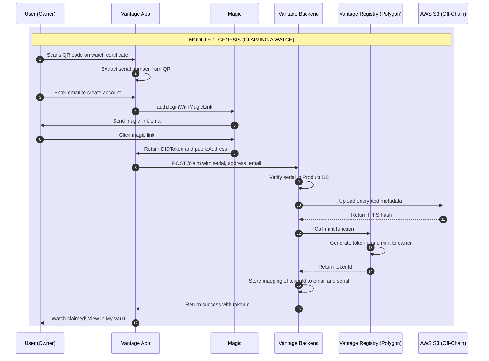
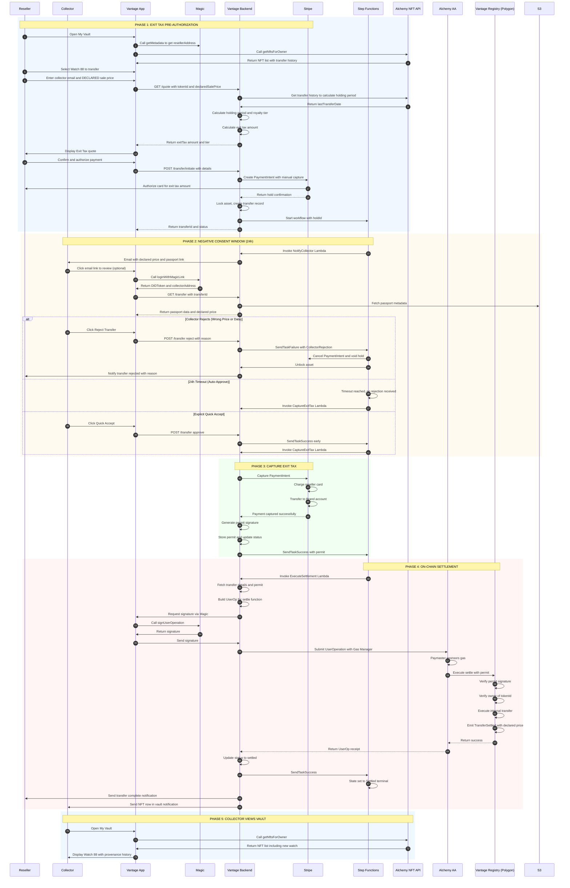

# Vantage Settlement Protocol: Technical Specification

**Project:** White-label Asset Governance Platform  
**Version:** 1.0 (Dev Ready)  
**Date:** February 2, 2026  
**Status:** MVP - Ready for Implementation

---

## Executive Summary

Vantage is a **Sovereign Smart Contract** platform that handles **Issuance** (minting) and **Restricted Settlement** (compliance-gated resales) of digital passports for luxury assets. Unlike a marketplace, Vantage is a **governance layer** that sits on top of any sales channel (eBay, Chrono24, private sales, etc.) to enforce brand rules on NFT transfers.

**The Model:** Physical assets are sold anywhere. When ownership changes, the reseller pays an Exit Tax (royalty) to transfer the digital passport (NFT) to the new owner. The protocol uses a **"Negative Consent"** model where collectors have 24 hours to verify the declared sale price before the transfer auto-completes.

**Key Characteristics:**
- **Not a Marketplace:** Physical sales happen outside Vantage (any channel)
- **Sovereign Contract:** Brand owns the ERC-721 registry (no platform dependencies)
- **Exit Tax Model:** Current owner pays royalty via Stripe to unlock NFT transfer
- **Negative Consent:** Collectors verify declared price; 24h auto-approve if no rejection
- **Dynamic Tiers:** Royalty rate adjusts based on holding duration (configurable for brand convenience)
- **Transfer Locks:** Minimum holding period prevents premature resale (anti-flip mechanism)
- **Provenance Protection:** Declared sale prices become permanent on-chain record
- **GDPR Compliant:** Twin data structure (on-chain state + off-chain PII)
- **Chain Agnostic:** Polygon (public) with compatibility for private networks (Aura/Quorum)
- **Orchestrated Workflow:** AWS Step Functions manages long-running, human-in-the-loop processes

---

## System Architecture

### Technology Stack

| Component | Technology | Purpose |
|-----------|-----------|---------|
| **Auth & Wallet** | Magic (magic.link) | Passwordless login, embedded wallets, signing |
| **Account Abstraction** | Alchemy AA (ERC-4337) | Gasless transactions, smart contract accounts |
| **NFT Indexing** | Alchemy NFT API | Query ownership, transfer history, holding period |
| **Workflow Engine** | AWS Step Functions | Orchestrate async flows with timeouts and callbacks |
| **Backend API** | Node.js/Lambda + DynamoDB | Royalty calculator, compliance gate, permit generation |
| **Payment Gateway** | Stripe | Fiat payment processing for royalties |
| **Blockchain** | Polygon (EVM) | NFT registry, settlement execution |
| **Smart Contract Framework** | OpenZeppelin Contracts | Secure, audited ERC-721, ERC-2981, ECDSA implementations |
| **Smart Contract Language** | Solidity ^0.8.20 | Sovereign asset registry with permit-gated transfers |

---

## Core Components

### 1. Magic (Identity & Wallet)
**What it does:**
- Passwordless authentication via email magic links
- Embedded, non-custodial wallets (users don't manage private keys)
- Returns `publicAddress` for blockchain operations and `DIDToken` for backend auth

**Integration points:**
- User login → Magic returns address
- Transaction signing → Magic signs UserOp or standard transaction
- Backend validates DIDToken to ensure authenticated user

**Dev notes:**
```javascript
// Frontend: Magic SDK
const magic = new Magic('pk_live_...');
const didToken = await magic.auth.loginWithMagicLink({ email });
const metadata = await magic.user.getMetadata(); // { publicAddress, email }

// Backend: Validate DIDToken
const { publicAddress, email } = await magic.token.validate(didToken);
```

### 2. Alchemy Account Abstraction (Gasless Transactions)
**What it does:**
- Smart Contract Accounts (SCAs) via ERC-4337
- Paymaster sponsors gas fees (brand pays, not user)
- Bundler submits UserOperations to chain

**Integration points:**
- Magic wallet = signer/owner of the Smart Account
- Vantage Backend builds UserOp → Magic signs → Alchemy Bundler submits
- Gas Manager policy: sponsor only `settle()` calls on Vantage contract

**Dev notes:**
```javascript
// Backend: Build UserOp for settlement
const userOp = {
  sender: smartAccountAddress, // SCA controlled by Magic wallet
  nonce: await entryPoint.getNonce(smartAccountAddress),
  callData: vantageContract.interface.encodeFunctionData('settle', [from, to, tokenId, permit]),
  paymasterAndData: '0x...' // Alchemy Gas Manager
};

// Request Magic signature
const signature = await magic.wallet.signUserOperation(userOp);

// Submit to Alchemy Bundler
await alchemyAA.sendUserOperation(userOp, signature);
```

### 3. Alchemy NFT API (Ownership & History)
**What it does:**
- Query NFTs by owner address
- Fetch transfer history and timestamps
- Calculate holding period for royalty tiers

**Integration points:**
- "My Vault" UI: List user's NFTs
- Royalty calculation: Fetch `lastTransferDate` to compute holding period

**Dev notes:**
```javascript
// Get user's NFTs
const nfts = await alchemy.nft.getNftsForOwner(ownerAddress, {
  contractAddresses: [VANTAGE_CONTRACT_ADDRESS]
});

// Get transfer history for holding period
const transfers = await alchemy.nft.getTransfersForOwner(ownerAddress, {
  contractAddresses: [VANTAGE_CONTRACT_ADDRESS]
});
const lastTransfer = transfers[0]; // Most recent
const holdingPeriodDays = (Date.now() - lastTransfer.metadata.blockTimestamp * 1000) / (1000 * 60 * 60 * 24);
```

### 4. AWS Step Functions (Orchestration)
**What it does:**
- Manages async workflows with "Negative Consent" model
- Callback pattern with task tokens for external events
- **Critical:** Timeout = Success (auto-approve), not failure
- Compensation logic for explicit rejections

**Workflow states:**
1. `AuthorizeExitTax` (create Stripe hold on reseller's card)
2. `CollectorReviewWindow` (24h for collector to verify/reject)
   - Timeout (24h) → Auto-approve (capture payment & settle)
   - Explicit rejection → Void hold & unlock asset
3. `CaptureExitTax` (capture Stripe hold from reseller)
4. `SettleOnChain` (execute on-chain transfer with permit)
5. `Settled` (terminal success) or `Cancelled` (terminal failure)

**Integration points:**
- Backend API calls `StartExecution` with transfer data
- Reseller authorizes Stripe hold (pre-auth, not captured)
- Collector can call `SendTaskFailure` to reject (within 24h)
- Timeout triggers auto-capture → settlement (normal flow)

**Dev notes:**
```json
{
  "Comment": "Vantage Exit Tax & Transfer Workflow (Negative Consent)",
  "StartAt": "AuthorizeExitTax",
  "States": {
    "AuthorizeExitTax": {
      "Type": "Task",
      "Resource": "arn:aws:lambda:invoke",
      "Parameters": {
        "FunctionName": "CreateStripeHold",
        "Payload": {
          "reseller.$": "$.resellerId",
          "royaltyAmount.$": "$.royaltyAmount",
          "transferId.$": "$.transferId"
        }
      },
      "ResultPath": "$.stripeHoldId",
      "Next": "CollectorReviewWindow"
    },
    "CollectorReviewWindow": {
      "Type": "Task",
      "Resource": "arn:aws:states:::lambda:invoke.waitForTaskToken",
      "Parameters": {
        "FunctionName": "NotifyCollector",
        "Payload": {
          "taskToken.$": "$$.Task.Token",
          "transferId.$": "$.transferId",
          "declaredSalePrice.$": "$.declaredSalePrice"
        }
      },
      "TimeoutSeconds": 86400,
      "Catch": [
        {
          "ErrorEquals": ["States.Timeout"],
          "ResultPath": "$.timeoutInfo",
          "Next": "CaptureExitTax"
        },
        {
          "ErrorEquals": ["CollectorRejection"],
          "ResultPath": "$.rejection",
          "Next": "VoidHoldAndUnlock"
        }
      ],
      "Next": "CaptureExitTax"
    },
    "CaptureExitTax": {
      "Type": "Task",
      "Resource": "arn:aws:lambda:invoke",
      "Parameters": {
        "FunctionName": "CaptureStripePayment",
        "Payload": {
          "holdId.$": "$.stripeHoldId"
        }
      },
      "Next": "GeneratePermit"
    },
    "GeneratePermit": {
      "Type": "Task",
      "Resource": "arn:aws:lambda:invoke",
      "Parameters": {
        "FunctionName": "GenerateTransferPermit",
        "Payload.$": "$"
      },
      "ResultPath": "$.permit",
      "Next": "SettleOnChain"
    },
    "SettleOnChain": {
      "Type": "Task",
      "Resource": "arn:aws:lambda:invoke",
      "Parameters": {
        "FunctionName": "ExecuteBlockchainSettlement",
        "Payload.$": "$"
      },
      "Next": "Settled"
    },
    "VoidHoldAndUnlock": {
      "Type": "Parallel",
      "Branches": [
        {
          "StartAt": "VoidStripeHold",
          "States": {
            "VoidStripeHold": {
              "Type": "Task",
              "Resource": "arn:aws:lambda:invoke",
              "Parameters": {
                "FunctionName": "VoidStripeHold",
                "Payload": {
                  "holdId.$": "$.stripeHoldId"
                }
              },
              "End": true
            }
          }
        },
        {
          "StartAt": "UnlockAsset",
          "States": {
            "UnlockAsset": {
              "Type": "Task",
              "Resource": "arn:aws:lambda:invoke",
              "Parameters": {
                "FunctionName": "UnlockAsset",
                "Payload": {
                  "tokenId.$": "$.tokenId"
                }
              },
              "End": true
            }
          }
        }
      ],
      "Next": "Cancelled"
    },
    "Settled": {
      "Type": "Succeed"
    },
    "Cancelled": {
      "Type": "Succeed"
    }
  }
}
```

### 5. Vantage Backend (Compliance Gate & Royalty Engine)
**What it does:**
- **Royalty Calculator:** Computes Exit Tax based on holding period and declared sale price
- **Stripe Integration:** Creates pre-authorization holds (manual capture) for reseller exit tax
- **Compliance Gate:** Validates payment, declared price, and generates cryptographic permit
- **Permit:** ECDSA signature proving exit tax was paid and collector had opportunity to verify
- **Provenance Guardian:** Stores declared sale prices as permanent on-chain record

**Royalty Logic (Time-Based Tiers):**
```javascript
function calculateRoyalty(salePrice, holdingPeriodDays) {
  let tierRate;
  if (holdingPeriodDays < 365) {
    tierRate = 0.10; // 10% - Short-term holding
  } else if (holdingPeriodDays < 1095) {
    tierRate = 0.05; // 5% - Standard
  } else {
    tierRate = 0.02; // 2% - Long-term holding
  }
  return salePrice * tierRate;
}
```

**Permit Generation (Backend Signer):**
```javascript
const ethers = require('ethers');

// Backend has a private key for signing permits
const backendWallet = new ethers.Wallet(BACKEND_PRIVATE_KEY);

async function generatePermit(transferId, from, to, tokenId, salePrice) {
  const message = ethers.utils.solidityKeccak256(
    ['uint256', 'address', 'address', 'uint256', 'uint256'],
    [transferId, from, to, tokenId, salePrice]
  );
  const signature = await backendWallet.signMessage(ethers.utils.arrayify(message));
  return signature; // 0x... bytes
}
```

**API Endpoints:**
- `GET /quote?tokenId=88&salePrice=5000` → Returns royalty amount
- `POST /transfer/initiate` → Starts Step Functions workflow
- `POST /transfer/:id/approve` → Collector accepts (sends task success)
- `POST /webhooks/stripe` → Payment confirmation (sends task success + generates permit)
- `POST /transfer/:id/settle` → Executes on-chain settlement with permit

### 6. Analytics & Dashboard System (Creator Insights)
**What it does:**
- Aggregates secondary market data for brand dashboards
- Tracks royalty revenue, geographic distribution, ownership patterns
- Provides real-time and historical metrics
- Powers creator/brand decision-making with actionable insights

**Data Sources:**

1. **On-Chain Events** (via Alchemy webhooks or polling)
   - `TransferSettled` events from Vantage contract
   - Transfer timestamps, from/to addresses, sale prices
   - Token ownership history

2. **Backend Records** (DynamoDB/PostgreSQL)
   - Stripe payment records (royalty amounts captured)
   - Transfer lifecycle states (initiated, approved, settled)
   - Declared sale prices and holding periods
   - Collector/reseller metadata (email, location if provided)

3. **Alchemy NFT API**
   - Current ownership distribution
   - Transfer frequency by token
   - Historical transfer prices

**Architecture:**

```
┌─────────────────┐
│ On-Chain Events │──┐
│ (Alchemy Hook) │  │
└─────────────────┘  │
                     │
┌─────────────────┐  │    ┌──────────────────┐
│ Stripe Webhooks │──┼───▶│ Event Processor  │
└─────────────────┘  │    │    (Lambda)      │
                     │    └──────────────────┘
┌─────────────────┐  │              │
│ Transfer APIs   │──┘              │
└─────────────────┘                 │
                                    ▼
                          ┌──────────────────┐
                          │ Analytics DB     │
                          │ (TimescaleDB/    │
                          │  Redshift)       │
                          └──────────────────┘
                                    │
                                    ▼
                          ┌──────────────────┐
                          │ Analytics API    │
                          │ (Lambda/Express) │
                          └──────────────────┘
                                    │
                                    ▼
                          ┌──────────────────┐
                          │ Creator Dashboard│
                          │    (React)       │
                          └──────────────────┘
```

**Data Models:**

**1. Transfers Table (Raw Events)**
```sql
CREATE TABLE transfers (
  transfer_id UUID PRIMARY KEY,
  token_id INTEGER NOT NULL,
  from_address VARCHAR(42) NOT NULL,
  to_address VARCHAR(42) NOT NULL,
  sale_price_cents INTEGER NOT NULL,
  royalty_cents INTEGER NOT NULL,
  holding_period_days INTEGER,
  status VARCHAR(20), -- pending, settled, rejected
  initiated_at TIMESTAMP NOT NULL,
  settled_at TIMESTAMP,
  tx_hash VARCHAR(66),
  collector_country VARCHAR(2), -- ISO country code
  INDEX idx_token_id (token_id),
  INDEX idx_settled_at (settled_at)
);
```

**2. Aggregated Metrics Table (Pre-computed)**
```sql
CREATE TABLE analytics_daily (
  date DATE NOT NULL,
  collection_id UUID NOT NULL,
  total_transfers INTEGER DEFAULT 0,
  total_revenue_cents INTEGER DEFAULT 0,
  avg_sale_price_cents INTEGER,
  unique_sellers INTEGER,
  unique_buyers INTEGER,
  PRIMARY KEY (date, collection_id)
);

CREATE TABLE analytics_by_country (
  collection_id UUID NOT NULL,
  country_code VARCHAR(2) NOT NULL,
  total_transfers INTEGER DEFAULT 0,
  total_revenue_cents INTEGER DEFAULT 0,
  last_updated TIMESTAMP,
  PRIMARY KEY (collection_id, country_code)
);

CREATE TABLE ownership_retention (
  collection_id UUID NOT NULL,
  holding_period_bucket VARCHAR(20), -- e.g., "0-6mo", "6-12mo", "1-3yr", "3yr+"
  transfer_count INTEGER DEFAULT 0,
  avg_holding_days INTEGER,
  PRIMARY KEY (collection_id, holding_period_bucket)
);
```

**Event Processing (Lambda):**
```javascript
// Listen to Alchemy webhook for on-chain events
exports.handler = async (event) => {
  const { activityType, fromAddress, toAddress, tokenId, value } = event;
  
  if (activityType === 'TRANSFER') {
    // Fetch transfer record from backend DB
    const transfer = await getTransferByTokenAndAddresses(tokenId, fromAddress, toAddress);
    
    if (transfer && transfer.status === 'settled') {
      // Already processed, deduplicate
      return { statusCode: 200, body: 'Already processed' };
    }
    
    // Get sale price and royalty from backend
    const { salePrice, royalty, holdingPeriod, collectorCountry } = transfer;
    
    // Insert raw transfer record
    await db.query(`
      INSERT INTO transfers (
        transfer_id, token_id, from_address, to_address, 
        sale_price_cents, royalty_cents, holding_period_days,
        status, initiated_at, settled_at, tx_hash, collector_country
      ) VALUES ($1, $2, $3, $4, $5, $6, $7, $8, $9, $10, $11, $12)
    `, [
      transfer.id, tokenId, fromAddress, toAddress,
      salePrice, royalty, holdingPeriod,
      'settled', transfer.initiatedAt, new Date(), event.txHash, collectorCountry
    ]);
    
    // Trigger aggregation
    await triggerDailyAggregation(transfer.collectionId);
    await triggerCountryAggregation(transfer.collectionId, collectorCountry);
    await triggerRetentionAggregation(transfer.collectionId, holdingPeriod);
    
    return { statusCode: 200, body: 'Analytics updated' };
  }
};

// Aggregate daily metrics (runs on schedule or trigger)
async function triggerDailyAggregation(collectionId) {
  const today = new Date().toISOString().split('T')[0];
  
  await db.query(`
    INSERT INTO analytics_daily (date, collection_id, total_transfers, total_revenue_cents, avg_sale_price_cents)
    SELECT 
      DATE(settled_at) as date,
      $1 as collection_id,
      COUNT(*) as total_transfers,
      SUM(royalty_cents) as total_revenue_cents,
      AVG(sale_price_cents) as avg_sale_price_cents
    FROM transfers
    WHERE collection_id = $1 AND DATE(settled_at) = $2 AND status = 'settled'
    GROUP BY DATE(settled_at)
    ON CONFLICT (date, collection_id) DO UPDATE SET
      total_transfers = EXCLUDED.total_transfers,
      total_revenue_cents = EXCLUDED.total_revenue_cents,
      avg_sale_price_cents = EXCLUDED.avg_sale_price_cents
  `, [collectionId, today]);
}
```

**Analytics API Endpoints:**

**1. Dashboard Overview**
```javascript
GET /api/analytics/dashboard?collectionId={id}

// Response
{
  "collectionId": "uuid",
  "totalRevenue": 125000, // Total royalties in cents
  "totalTransfers": 48,
  "avgSalePrice": 550000,
  "avgHoldingPeriod": 287, // days
  "revenueByMonth": [
    { "month": "2025-10", "revenue": 45000, "transfers": 15 },
    { "month": "2025-11", "revenue": 52000, "transfers": 18 },
    { "month": "2025-12", "revenue": 28000, "transfers": 15 }
  ],
  "geographicDistribution": [
    { "country": "CH", "countryName": "Switzerland", "transfers": 18, "revenue": 58000 },
    { "country": "US", "countryName": "United States", "transfers": 12, "revenue": 38000 },
    { "country": "DE", "countryName": "Germany", "transfers": 10, "revenue": 20000 },
    { "country": "FR", "countryName": "France", "transfers": 8, "revenue": 9000 }
  ],
  "ownershipRetention": [
    { "bucket": "Early (< 6mo)", "count": 22, "percentage": 45.8 },
    { "bucket": "Standard (6mo - 1yr)", "count": 15, "percentage": 31.3 },
    { "bucket": "Collector (1-3yr)", "count": 8, "percentage": 16.7 },
    { "bucket": "Long-term (3yr+)", "count": 3, "percentage": 6.2 }
  ]
}
```

**2. Revenue Trends**
```javascript
GET /api/analytics/revenue?collectionId={id}&period=30d

// Returns time-series data for charting
{
  "data": [
    { "date": "2025-12-01", "revenue": 2500, "transfers": 3 },
    { "date": "2025-12-02", "revenue": 1800, "transfers": 2 },
    // ...
  ]
}
```

**3. Top Performing Assets**
```javascript
GET /api/analytics/top-assets?collectionId={id}&limit=10

{
  "assets": [
    {
      "tokenId": 88,
      "serialNumber": "LE-88-2023",
      "totalTransfers": 5,
      "totalRevenue": 8500,
      "avgSalePrice": 650000,
      "lastSalePrice": 700000,
      "currentOwner": "0x1234..."
    },
    // ...
  ]
}
```

**Implementation Stack:**

| Component | Technology | Purpose |
|-----------|-----------|---------|
| **Event Ingestion** | Alchemy Webhooks + Lambda | Real-time on-chain event capture |
| **Raw Data Store** | PostgreSQL or DynamoDB | Transfer records, Stripe payments |
| **Analytics DB** | TimescaleDB or AWS Redshift | Time-series aggregations, fast queries |
| **Aggregation Jobs** | Lambda (scheduled) or AWS Glue | Daily/hourly metric computation |
| **Caching** | Redis or ElastiCache | Dashboard query results (TTL: 5min) |
| **Analytics API** | Node.js/Lambda + API Gateway | REST endpoints for dashboard |
| **Visualization** | React + Recharts/Chart.js | Frontend charts and tables |

**Data Refresh Strategy:**

- **Real-time:** On-chain events trigger immediate aggregation (< 30s latency)
- **Batch:** Hourly job re-aggregates last 24h (corrects any missed events)
- **Cache:** Dashboard queries cached for 5 minutes (reduce DB load)
- **Historical:** Data older than 90 days archived to S3 (cost optimization)

**Dev Implementation:**
```javascript
// Backend: Analytics API endpoint
app.get('/api/analytics/dashboard', async (req, res) => {
  const { collectionId } = req.query;
  
  // Check cache first
  const cached = await redis.get(`analytics:${collectionId}`);
  if (cached) {
    return res.json(JSON.parse(cached));
  }
  
  // Query aggregated data
  const [revenue, geo, retention] = await Promise.all([
    db.query('SELECT * FROM analytics_daily WHERE collection_id = $1 ORDER BY date DESC LIMIT 90', [collectionId]),
    db.query('SELECT * FROM analytics_by_country WHERE collection_id = $1 ORDER BY total_revenue_cents DESC', [collectionId]),
    db.query('SELECT * FROM ownership_retention WHERE collection_id = $1', [collectionId])
  ]);
  
  const dashboard = {
    totalRevenue: revenue.rows.reduce((sum, r) => sum + r.total_revenue_cents, 0),
    totalTransfers: revenue.rows.reduce((sum, r) => sum + r.total_transfers, 0),
    revenueByMonth: groupByMonth(revenue.rows),
    geographicDistribution: geo.rows.map(formatGeoData),
    ownershipRetention: retention.rows.map(formatRetentionData)
  };
  
  // Cache for 5 minutes
  await redis.setex(`analytics:${collectionId}`, 300, JSON.stringify(dashboard));
  
  res.json(dashboard);
});
```

**Frontend: Dashboard Component**
```jsx
// React component for creator dashboard
import { useEffect, useState } from 'react';
import { LineChart, BarChart, PieChart } from 'recharts';

function CreatorDashboard({ collectionId }) {
  const [analytics, setAnalytics] = useState(null);
  
  useEffect(() => {
    fetch(`/api/analytics/dashboard?collectionId=${collectionId}`)
      .then(res => res.json())
      .then(setAnalytics);
  }, [collectionId]);
  
  if (!analytics) return <Loading />;
  
  return (
    <div className="dashboard">
      <MetricCard title="Total Revenue" value={formatCurrency(analytics.totalRevenue)} />
      <MetricCard title="Total Transfers" value={analytics.totalTransfers} />
      
      <LineChart data={analytics.revenueByMonth} />
      <BarChart data={analytics.geographicDistribution} />
      <PieChart data={analytics.ownershipRetention} />
    </div>
  );
}
```

### 7. OpenZeppelin Contracts (Smart Contract Framework)
**What it does:**
- Provides battle-tested, audited implementations of token standards
- Reduces security risks by using community-vetted code
- Saves development time with ready-to-use components
- Regularly updated with security patches

**Components used in Vantage:**

1. **ERC721.sol** - NFT Standard Implementation
   - Core NFT functionality (mint, transfer, burn)
   - Ownership tracking
   - Metadata URI management
   - Transfer hooks and approvals

2. **ERC2981.sol** - Royalty Standard
   - `royaltyInfo()` function for marketplace compatibility
   - Configurable royalty percentage and receiver
   - While advisory-only, signals brand's expected royalty to compliant platforms

3. **ECDSA.sol** - Signature Verification
   - Cryptographic signature recovery
   - Used to verify backend-signed permits
   - Gas-efficient signature validation
   - Prevents signature malleability attacks

4. **Ownable.sol** (optional) - Access Control
   - Restricts sensitive functions (mint, update compliance signer) to owner
   - Ownership transfer mechanism
   - Emergency controls

**Why OpenZeppelin:**
- ✅ **Security:** Audited by multiple firms, used in billions of dollars of assets
- ✅ **Standards Compliance:** Strictly follows EIP specifications
- ✅ **Gas Optimization:** Efficient implementations
- ✅ **Community Support:** Extensive documentation and examples
- ✅ **Upgradeability:** Compatible with proxy patterns (if needed later)

**Installation:**
```bash
npm install @openzeppelin/contracts
# or
yarn add @openzeppelin/contracts
```

**Version used:** `^5.0.0` (or specify exact version for production)

**Dev notes:**
```solidity
// Import only what you need
import "@openzeppelin/contracts/token/ERC721/ERC721.sol";
import "@openzeppelin/contracts/token/common/ERC2981.sol";
import "@openzeppelin/contracts/utils/cryptography/ECDSA.sol";

// Inherit and extend
contract VantageAssetRegistry is ERC721, ERC2981 {
    using ECDSA for bytes32; // Attach library functions
    
    // Override functions to add custom logic
    function transferFrom(...) public override {
        revert("Use settle() instead");
    }
}
```

### 7. Vantage Contract (Sovereign ERC-721)
**What it does:**
- Standard ERC-721 NFT contract
- Overrides `transferFrom` to block direct transfers
- Exposes `settle(permit)` function requiring backend-signed permit
- Verifies permit signature before executing transfer

**Contract code:**
```solidity
// SPDX-License-Identifier: MIT
pragma solidity ^0.8.20;

// OpenZeppelin Imports
import "@openzeppelin/contracts/token/ERC721/ERC721.sol";      // Base NFT implementation
import "@openzeppelin/contracts/token/common/ERC2981.sol";     // Royalty standard
import "@openzeppelin/contracts/utils/cryptography/ECDSA.sol"; // Signature verification
import "@openzeppelin/contracts/access/Ownable.sol";           // Access control

/**
 * @title VantageAssetRegistry
 * @notice Sovereign NFT registry with permit-gated transfers
 * @dev Extends OpenZeppelin's ERC721 and ERC2981 with custom transfer logic
 */
contract VantageAssetRegistry is ERC721, ERC2981, Ownable {
    using ECDSA for bytes32; // Attach ECDSA library to bytes32
    
    // Backend's public address - verifies permits
    address public immutable COMPLIANCE_SIGNER;
    
    // Token ID counter for sequential minting
    uint256 private _tokenIdCounter;
    
    // Maps tokenId to IPFS CID (off-chain metadata)
    mapping(uint256 => string) private _metadataHashes;
    
    /**
     * @param complianceSigner Backend's public address for permit verification
     */
    constructor(address complianceSigner) 
        ERC721("Brand Asset Registry", "BASSET") 
        Ownable(msg.sender)
    {
        COMPLIANCE_SIGNER = complianceSigner;
        
        // Set default royalty: 5% to contract owner (can be customized per token)
        _setDefaultRoyalty(msg.sender, 500); // 500 basis points = 5%
    }
    
    // ==================== GENESIS: MINTING ====================
    
    /**
     * @notice Mint new NFT when user claims physical asset
     * @dev Only contract owner can mint (brand)
     * @param to Recipient address (user's wallet)
     * @param metadataHash IPFS CID for off-chain data
     * @return tokenId The newly minted token ID
     */
    function mint(address to, string memory metadataHash) 
        external 
        onlyOwner // OpenZeppelin access control
        returns (uint256) 
    {
        uint256 tokenId = ++_tokenIdCounter;
        _mint(to, tokenId); // OpenZeppelin internal mint
        _metadataHashes[tokenId] = metadataHash;
        return tokenId;
    }
    
    // ==================== BLOCK DIRECT TRANSFERS ====================
    
    /**
     * @notice Override ERC721 transferFrom to block direct transfers
     * @dev Forces all transfers through settle() which requires permit
     */
    function transferFrom(address, address, uint256) 
        public 
        pure 
        override 
    {
        revert("Direct transfers disabled. Use settle() with permit.");
    }
    
    /**
     * @notice Override ERC721 safeTransferFrom to block direct transfers
     */
    function safeTransferFrom(address, address, uint256, bytes memory) 
        public 
        pure 
        override 
    {
        revert("Direct transfers disabled. Use settle() with permit.");
    }
    
    // ==================== SETTLEMENT: PERMIT-GATED TRANSFER ====================
    
    /**
     * @notice Execute transfer with backend-signed permit (proving exit tax paid)
     * @param transferId Unique transfer identifier (prevents replay)
     * @param from Current owner
     * @param to New owner
     * @param tokenId Token to transfer
     * @param salePrice Declared sale price (for provenance)
     * @param permit Backend's ECDSA signature
     */
    function settle(
        uint256 transferId,
        address from,
        address to,
        uint256 tokenId,
        uint256 salePrice,
        bytes memory permit
    ) external {
        // Verify ownership (OpenZeppelin's ownerOf)
        require(ownerOf(tokenId) == from, "From address is not owner");
        
        // Build message hash (same structure backend signed)
        bytes32 message = keccak256(
            abi.encodePacked(transferId, from, to, tokenId, salePrice)
        );
        
        // Convert to Ethereum signed message format (OpenZeppelin ECDSA)
        bytes32 ethSignedMessage = message.toEthSignedMessageHash();
        
        // Recover signer from signature (OpenZeppelin ECDSA)
        address signer = ethSignedMessage.recover(permit);
        
        // Verify signature came from authorized backend
        require(
            signer == COMPLIANCE_SIGNER, 
            "Invalid permit - exit tax not paid"
        );
        
        // Execute transfer using internal function (bypasses override)
        _transfer(from, to, tokenId); // OpenZeppelin internal transfer
        
        emit TransferSettled(transferId, tokenId, from, to, salePrice);
    }
    
    // ==================== METADATA ====================
    
    /**
     * @notice Get token metadata URI
     * @dev Returns IPFS hash stored during minting
     */
    function tokenURI(uint256 tokenId) 
        public 
        view 
        override 
        returns (string memory) 
    {
        require(ownerOf(tokenId) != address(0), "Token does not exist");
        return string(abi.encodePacked("ipfs://", _metadataHashes[tokenId]));
    }
    
    // ==================== ROYALTY (ERC2981) ====================
    
    /**
     * @notice Signals expected royalty to compliant marketplaces
     * @dev Inherited from OpenZeppelin ERC2981
     * Note: This is advisory only. Vantage enforces royalties via settle()
     */
    function supportsInterface(bytes4 interfaceId) 
        public 
        view 
        override(ERC721, ERC2981) 
        returns (bool) 
    {
        return super.supportsInterface(interfaceId);
    }
    
    // ==================== EVENTS ====================
    
    event TransferSettled(
        uint256 indexed transferId, 
        uint256 indexed tokenId, 
        address indexed from, 
        address to, 
        uint256 salePrice
    );
}
```

---

## Data Architecture (GDPR "Twin" Model)

To ensure GDPR compliance, data is strictly separated:

### On-Chain (Public/Pseudonymous)
**Storage:** Polygon blockchain  
**Content:**
- `tokenId` (watch identifier)
- `ownerAddress` (wallet address, no PII)
- `metadataHash` (IPFS CID pointing to encrypted off-chain data)
- `royaltyInfo` (ERC-2981 standard)
- `transferHistory` (timestamps, addresses)

**Privacy:** Public but pseudonymous. Addresses are not linked to identities on-chain.

### Off-Chain (Private/Encrypted)
**Storage:** AWS S3 + DynamoDB  
**Content:**
- Owner name, email, phone
- Watch details: serial number, high-res photos, warranty status
- Service history
- Transfer request details (pending, collector email)

**Privacy:** Encrypted at rest (AES-256), access controlled via IAM, linked to wallet address but never exposed on-chain.

**Linking mechanism:**
- `tokenURI(tokenId)` → returns IPFS hash
- IPFS content → encrypted JSON with reference to S3 bucket
- Backend decrypts and serves to authenticated user only

---

## Business Logic & Key Concepts

### Vantage is NOT a Marketplace

**Critical distinction:** Vantage does NOT facilitate the physical sale of assets. It is a **governance layer** that:
- Enforces brand rules on NFT transfers
- Collects royalties when ownership changes
- Maintains provenance records on-chain

**The physical transaction happens elsewhere:**
- eBay, Chrono24, private WhatsApp deals, in-person sales, etc.
- Collector may already physically possess the watch before the NFT transfer
- Payment for the watch happens outside Vantage (cash, Venmo, wire, etc.)

**Vantage only governs the digital twin (NFT):**
- Reseller initiates NFT transfer after selling the physical watch
- Reseller declares the sale price (for royalty calculation and provenance)
- Reseller pays exit tax (royalty) to unlock the transfer
- Collector verifies the declaration is accurate
- NFT transfers on-chain with permanent record of sale price

### The "Negative Consent" Model

**Why collector review matters (even though they're not paying):**

1. **Provenance Protection:**
   - Declared sale price becomes permanent on-chain record
   - If reseller lies ("I sold it for 1 CHF" to avoid tax), it pollutes asset history
   - Future buyers see false price data, affecting appraisals and insurance

2. **Tax Evasion Prevention:**
   - Reseller might under-declare to pay lower royalty
   - Collector has incentive to report honestly (correct valuation benefits their asset)
   - Example: Watch sold for 10,000 CHF, reseller declares 1,000 CHF → Collector rejects

3. **Fraud Detection:**
   - Reseller might over-declare to inflate asset value artificially
   - Collector rejects: "I only paid 2,000 CHF, not 8,000 CHF"
   - Prevents wash trading and price manipulation

4. **Data Integrity:**
   - Wrong serial number, mismatched photos, incorrect warranty status
   - Collector can reject if passport data doesn't match physical watch received

**How it works:**
```
Reseller: "I sold Watch #88 for 5,000 CHF to collector@example.com"
System: Creates Stripe hold for 500 CHF (10% royalty)
Collector: Receives email "Incoming NFT, declared value 5,000 CHF"

Option A (99% of cases): Collector does nothing → 24h passes → Auto-approve
Option B (fraud/error): Collector clicks "Reject - Wrong price" → Hold voided
Option C (fast track): Collector clicks "Quick Accept" → Immediate capture
```

**Benefits:**
- ✅ Low friction: Most transfers auto-complete
- ✅ Fraud protection: Collector can block false declarations
- ✅ Provenance integrity: On-chain records are trustworthy
- ✅ Brand revenue: Tax evasion is difficult

### The Exit Tax Calculation

**Inputs:**
- `declaredSalePrice` (what reseller claims they sold for)
- `holdingPeriod` (time reseller owned the asset, from blockchain)

**Logic:**
```javascript
function calculateExitTax(declaredSalePrice, holdingPeriodDays) {
  let tierRate;
  if (holdingPeriodDays < 365) {
    tierRate = 0.10; // 10% - Short-term holding
  } else if (holdingPeriodDays < 1095) {
    tierRate = 0.05; // 5% - Standard
  } else {
    tierRate = 0.02; // 2% - Long-term holding
  }
  return declaredSalePrice * tierRate;
}
```

**Example:**
- Watch held for 6 months (< 1 year) → 10% rate
- Declared sale: 5,000 CHF
- Exit tax: 500 CHF
- Reseller authorizes 500 CHF → Stripe hold
- After 24h (if no rejection) → Capture 500 CHF → Transfer NFT

---

## Complete Sequence Diagrams

### Flow 1: Genesis (Minting/Claiming)



### Flow 2: Settlement (Reselling with Exit Tax & Negative Consent)

**Context:** Physical watch was already sold outside Vantage (eBay, private sale, etc.). This flow only governs the NFT transfer and exit tax collection.



---

## Error Handling & Rollback

### Timeout Scenarios (Negative Consent Model)

| State | Timeout | Action |
|-------|---------|--------|
| `CollectorReviewWindow` | 24 hours | **Success:** Auto-approve, capture exit tax, proceed to settlement |
| `SettlementPending` | 5 minutes | Retry 3x, then manual intervention (payment already captured) |

**Note:** Unlike traditional flows, timeout in `CollectorReviewWindow` is the HAPPY PATH (auto-approve), not an error.

### Rejection Scenarios

**Collector explicitly rejects transfer:**
1. Collector clicks "Reject" with reason (wrong price, wrong asset, etc.)
2. Backend calls `SendTaskFailure(taskToken, "CollectorRejection")`
3. Step Functions → `VoidHoldAndUnlock` parallel branches:
   - Cancel Stripe PaymentIntent (void hold on reseller's card)
   - Unlock asset in database
4. Notify reseller: "Transfer rejected by collector - Reason: [price mismatch]"
5. Reseller can re-initiate with corrected information

**Reseller's card authorization fails:**
1. Stripe returns error on PaymentIntent creation
2. Backend returns 402 Payment Required to frontend
3. Prompt reseller: "Payment method declined. Update card and retry"
4. No Step Functions workflow started (pre-flight check)

**Reseller's card capture fails (after 24h):**
1. Stripe capture attempt fails (insufficient funds, card expired, etc.)
2. Backend calls `SendTaskFailure(taskToken, "CaptureFailure")`
3. Step Functions → `VoidHoldAndUnlock`
4. Notify reseller: "Payment capture failed. Transfer cancelled"
5. Notify collector: "Transfer cancelled - reseller payment issue"

**On-chain settlement fails:**
1. Contract reverts (e.g., invalid permit, asset already transferred)
2. UserOp fails, Alchemy returns error
3. Backend logs error, marks transfer as `failed`
4. **Critical:** Exit tax already captured → initiate Stripe refund to reseller
5. Notify both parties, manual review required

### Provenance Fraud Detection

**Scenario: Collector claims declared price is wrong**
1. Collector rejects with reason: "Declared 5000 CHF but I only paid 2000 CHF"
2. System logs rejection reason and both parties' info
3. Manual review: Check off-chain evidence (invoices, messages)
4. If fraud confirmed: Ban reseller, potential legal action
5. If collector lying: Note on collector's record (reputation system)

---

## Implementation Checklist

### Phase 0: Smart Contract Development
- [ ] Install OpenZeppelin Contracts (`npm install @openzeppelin/contracts`)
- [ ] Set up Hardhat or Foundry development environment
- [ ] Write VantageAssetRegistry contract (extending OpenZeppelin ERC721/ERC2981)
- [ ] Write unit tests for:
  - [ ] Minting functionality
  - [ ] Transfer blocking (transferFrom should revert)
  - [ ] Permit verification (valid and invalid signatures)
  - [ ] Settlement flow
- [ ] Run security analysis (Slither, Mythril)
- [ ] Deploy to testnet (Polygon Mumbai or Amoy)
- [ ] Verify contract on Polygonscan
- [ ] Test all functions on testnet

### Phase 1: Genesis (Claiming)
- [ ] Integrate Magic SDK (frontend + backend validation)
- [ ] Build `/claim` endpoint (verify serial, mint NFT via contract)
- [ ] Set up S3 bucket for off-chain metadata (encrypted)
- [ ] Generate IPFS hashes for metadata
- [ ] QR code generation for watch certificates
- [ ] Test full claiming flow end-to-end

### Phase 2: Settlement (Reselling)
- [ ] Integrate Alchemy NFT API (holding period calculation)
- [ ] Build royalty calculator with tier logic and declared price input
- [ ] Set up Stripe account with manual capture enabled
- [ ] Implement Stripe PaymentIntent creation (capture_method: manual)
- [ ] Implement Stripe capture and cancel/void logic
- [ ] Deploy Step Functions workflow with negative consent logic
- [ ] Implement permit generation (backend signer)
- [ ] Integrate Alchemy AA (Gas Manager setup)
- [ ] Build settlement Lambda (UserOp builder)
- [ ] Build collector notification email template with review link

### Phase 3: Frontend
- [ ] Magic login flow
- [ ] "My Vault" (list NFTs via Alchemy)
- [ ] Transfer initiation UI (collector email, DECLARED sale price)
- [ ] Exit tax quote display (show tier and amount)
- [ ] Reseller: Stripe card authorization UI (pre-auth, not capture)
- [ ] Collector review screen (passport data + declared price verification)
- [ ] Collector: Reject transfer modal (with reason selection)
- [ ] Collector: Quick Accept button (optional early approval)
- [ ] Status tracker (pending_review, approved, captured, settled, rejected)

### Phase 4: Analytics & Dashboard
- [ ] Set up analytics database (TimescaleDB or PostgreSQL with time-series extension)
- [ ] Create data models:
  - [ ] Transfers table (raw events)
  - [ ] analytics_daily table (aggregated metrics)
  - [ ] analytics_by_country table (geographic distribution)
  - [ ] ownership_retention table (holding period buckets)
- [ ] Implement event processor Lambda:
  - [ ] Listen to Alchemy webhooks for TransferSettled events
  - [ ] Insert raw transfer records
  - [ ] Trigger aggregation jobs
- [ ] Build aggregation functions:
  - [ ] Daily revenue and transfer counts
  - [ ] Geographic distribution by country
  - [ ] Ownership retention buckets
  - [ ] Top performing assets
- [ ] Implement Analytics API endpoints:
  - [ ] GET /api/analytics/dashboard (overview metrics)
  - [ ] GET /api/analytics/revenue (time-series data)
  - [ ] GET /api/analytics/top-assets (best performers)
  - [ ] GET /api/analytics/retention (holding patterns)
- [ ] Set up caching layer (Redis/ElastiCache) for dashboard queries
- [ ] Build Creator Dashboard UI:
  - [ ] Revenue overview cards
  - [ ] Line chart for revenue trends
  - [ ] Bar chart for geographic distribution
  - [ ] Pie chart for ownership retention
  - [ ] Table for top performing assets
- [ ] Implement scheduled aggregation job (hourly/daily)
- [ ] Set up Alchemy webhook endpoint for real-time updates

### Phase 5: Testing
- [ ] Unit tests for royalty calculator
- [ ] Contract tests (permit verification, transfer blocking)
- [ ] Integration test: full flow on testnet
- [ ] Stripe test mode validation
- [ ] Step Functions timeout testing
- [ ] Gas Manager budget limits

---

## Configuration & Deployment

### Environment Variables
```bash
# Magic
MAGIC_PUBLISHABLE_KEY=pk_live_...
MAGIC_SECRET_KEY=sk_live_...

# Alchemy
ALCHEMY_API_KEY=...
ALCHEMY_POLICY_ID=... # Gas Manager policy
ALCHEMY_NETWORK=polygon-mainnet

# Stripe
STRIPE_SECRET_KEY=sk_live_...
STRIPE_WEBHOOK_SECRET=whsec_...

# Contract
VANTAGE_CONTRACT_ADDRESS=0x...
BACKEND_PRIVATE_KEY=0x... # For permit signing
COMPLIANCE_SIGNER_ADDRESS=0x... # Public key in contract

# AWS
AWS_REGION=us-east-1
STEP_FUNCTIONS_ARN=arn:aws:states:...
S3_BUCKET=le-passports-prod
```

### Smart Contract Setup

**1. Initialize Hardhat Project**
```bash
mkdir vantage-contracts && cd vantage-contracts
npm init -y
npm install --save-dev hardhat @nomicfoundation/hardhat-toolbox
npx hardhat init
```

**2. Install OpenZeppelin Contracts**
```bash
npm install @openzeppelin/contracts
```

**3. Project Structure**
```
vantage-contracts/
├── contracts/
│   └── VantageAssetRegistry.sol
├── scripts/
│   └── deploy.js
├── test/
│   └── VantageAssetRegistry.test.js
├── hardhat.config.js
└── package.json
```

**4. Configure Hardhat (`hardhat.config.js`)**
```javascript
require("@nomicfoundation/hardhat-toolbox");
require("@nomicfoundation/hardhat-verify");

module.exports = {
  solidity: {
    version: "0.8.20",
    settings: {
      optimizer: {
        enabled: true,
        runs: 200
      }
    }
  },
  networks: {
    polygonMumbai: {
      url: process.env.POLYGON_MUMBAI_RPC || "https://rpc-mumbai.maticvigil.com",
      accounts: [process.env.DEPLOYER_PRIVATE_KEY],
      chainId: 80001
    },
    polygon: {
      url: process.env.POLYGON_RPC || "https://polygon-rpc.com",
      accounts: [process.env.DEPLOYER_PRIVATE_KEY],
      chainId: 137
    }
  },
  etherscan: {
    apiKey: {
      polygon: process.env.POLYGONSCAN_API_KEY,
      polygonMumbai: process.env.POLYGONSCAN_API_KEY
    }
  }
};
```

**5. Deployment Script (`scripts/deploy.js`)**
```javascript
const hre = require("hardhat");

async function main() {
  // Get deployer account
  const [deployer] = await hre.ethers.getSigners();
  console.log("Deploying with account:", deployer.address);
  
  // Backend signer address (for permit verification)
  const complianceSigner = process.env.COMPLIANCE_SIGNER_ADDRESS;
  if (!complianceSigner) {
    throw new Error("COMPLIANCE_SIGNER_ADDRESS not set");
  }
  
  // Deploy contract
  const VantageAssetRegistry = await hre.ethers.getContractFactory("VantageAssetRegistry");
  const registry = await VantageAssetRegistry.deploy(complianceSigner);
  await registry.waitForDeployment();
  
  const address = await registry.getAddress();
  console.log("VantageAssetRegistry deployed to:", address);
  console.log("Compliance Signer:", complianceSigner);
  
  // Wait for block confirmations before verifying
  console.log("Waiting for block confirmations...");
  await registry.deploymentTransaction().wait(5);
  
  // Verify on Polygonscan
  console.log("Verifying contract on Polygonscan...");
  await hre.run("verify:verify", {
    address: address,
    constructorArguments: [complianceSigner]
  });
  
  console.log("Deployment complete!");
}

main()
  .then(() => process.exit(0))
  .catch((error) => {
    console.error(error);
    process.exit(1);
  });
```

**6. Deploy to Testnet**
```bash
# Set environment variables
export DEPLOYER_PRIVATE_KEY=0x...
export COMPLIANCE_SIGNER_ADDRESS=0x...
export POLYGON_MUMBAI_RPC=https://...
export POLYGONSCAN_API_KEY=...

# Deploy
npx hardhat run scripts/deploy.js --network polygonMumbai

# Example output:
# Deploying with account: 0x1234...
# VantageAssetRegistry deployed to: 0xABCD...
# Compliance Signer: 0x5678...
# Verifying contract on Polygonscan...
# Deployment complete!
```

**7. Test Contract**
```bash
# Run unit tests
npx hardhat test

# Run specific test
npx hardhat test test/VantageAssetRegistry.test.js

# Check gas usage
REPORT_GAS=true npx hardhat test
```

**8. Deploy to Mainnet (Polygon)**
```bash
# Same as testnet but use polygon network
npx hardhat run scripts/deploy.js --network polygon
```

**9. Configure Alchemy Gas Manager**
```bash
# Via Alchemy Dashboard:
# 1. Go to Gas Manager → Create Policy
# 2. Add CONTRACT_ADDRESS to allowed contracts
# 3. Whitelist settle() function selector
# 4. Set spending limit: 1000 MATIC/month
# 5. Fund paymaster with MATIC
```

**10. Post-Deployment Verification**
```bash
# Interact with deployed contract
npx hardhat console --network polygonMumbai

# In console:
const registry = await ethers.getContractAt(
  "VantageAssetRegistry", 
  "0xYOUR_CONTRACT_ADDRESS"
);

# Test mint (only owner can call)
await registry.mint("0xUSER_ADDRESS", "QmIPFS_HASH");

# Verify compliance signer
console.log(await registry.COMPLIANCE_SIGNER());
```

---

## Security Considerations

### Smart Contract (OpenZeppelin Security)
- ✅ **OpenZeppelin Contracts:** Battle-tested, audited implementations reduce attack surface
- ✅ **Only `settle()` can transfer:** Direct transfers blocked via `override` + `revert`
- ✅ **Permit signature verification:** ECDSA prevents replay attacks and unauthorized transfers
- ✅ **`transferId` uniqueness:** Backend tracks used IDs to prevent replay
- ✅ **Access control:** `onlyOwner` modifier (OpenZeppelin) restricts minting to brand
- ✅ **Integer overflow protection:** Solidity 0.8+ has built-in checks
- ✅ **Reentrancy protection:** Not needed (no external calls during transfer)
- ⚠️ **Backend private key security:** Use AWS KMS or Hardware Security Module (HSM) for production
- ⚠️ **Rate limiting on mint():** Implement off-chain checks to prevent abuse
- ⚠️ **Contract upgradeability:** Current design is immutable. Consider OpenZeppelin's proxy pattern if future upgrades needed
- ⚠️ **Emergency pause:** Consider adding OpenZeppelin's `Pausable` for critical bugs

**OpenZeppelin-specific best practices:**
```solidity
// Pin exact version for production (no ^)
import "@openzeppelin/contracts@5.0.1/token/ERC721/ERC721.sol";

// Use OpenZeppelin's ReentrancyGuard if adding payable functions
import "@openzeppelin/contracts/security/ReentrancyGuard.sol";

// Consider Pausable for emergency stops
import "@openzeppelin/contracts/security/Pausable.sol";

contract VantageAssetRegistry is ERC721, ERC2981, Ownable, Pausable {
    function settle(...) external whenNotPaused {
        // Transfer logic
    }
}
```

**Security audit recommendations:**
- [ ] Run Slither static analysis: `slither contracts/`
- [ ] Run Mythril symbolic execution: `myth analyze contracts/VantageAssetRegistry.sol`
- [ ] Use OpenZeppelin Defender for monitoring and alerts
- [ ] Consider professional audit before mainnet (Trail of Bits, ConsenSys Diligence)

### Backend
- ✅ DIDToken validation for all authenticated endpoints
- ✅ Stripe webhook signature verification (prevents fake payment events)
- ✅ CORS configuration (only allow vantage.com)
- ✅ Rate limiting on permit generation (prevent DoS)
- ⚠️ Step Functions execution throttling (prevent workflow spam)
- ⚠️ Database encryption for PII (email, name, serial numbers)
- ⚠️ Permit generation key rotation policy (rotate every 90 days)

### GDPR
- ✅ Right to erasure: Delete off-chain data (on-chain remains pseudonymous)
- ✅ Data portability: Export user data via API
- ✅ Consent management: User agrees to T&C during claiming
- ✅ Data minimization: Only store necessary PII
- ⚠️ Data retention: Define policy for unclaimed watches (suggest 2 years)
- ⚠️ Cross-border transfers: Ensure compliance if users in EU

---

## FAQ for Developers

**Q: Is Vantage a marketplace? Where do physical sales happen?**  
A: No. Vantage is a **governance layer**, not a marketplace. Physical assets are sold anywhere (eBay, Chrono24, private sales, etc.). Vantage only governs the NFT transfer and collects exit tax when ownership changes.

**Q: Does the collector pay anything through Vantage?**  
A: No. The collector pays the reseller for the physical watch outside Vantage (cash, Venmo, wire, etc.). Only the reseller pays through Vantage (the exit tax/royalty).

**Q: Why does the collector need to review if they're not paying?**  
A: To verify the declared sale price is accurate. If reseller under-declares ("I sold for 1 CHF" to avoid tax), collector can reject. This protects provenance integrity and prevents tax evasion.

**Q: What happens if the collector does nothing for 24 hours?**  
A: The transfer auto-approves (negative consent). This is the normal flow - collector only acts if something is wrong.

**Q: Why not use standard ERC-721 royalty enforcement?**  
A: ERC-2981 is advisory only. Marketplaces can ignore it. Vantage's `settle()` function makes payment **mandatory** before transfer.

**Q: Can users sell on OpenSea?**  
A: No. Direct transfers are blocked. They must use Vantage to transfer the NFT (physical sale can happen anywhere).

**Q: What if exit tax capture succeeds but on-chain transfer fails?**  
A: Backend initiates refund via Stripe API. Manual review logs the incident for reconciliation.

**Q: How do we handle chain congestion (high gas)?**  
A: Alchemy Gas Manager buffers volatility. For extreme cases, Step Functions can retry with exponential backoff.

**Q: Is the backend a single point of failure?**  
A: Yes, for permit generation. Mitigation: Deploy backend across multiple regions, use AWS KMS for key security, implement permit caching.

**Q: Can the brand switch providers later?**  
A: Yes. The contract is sovereign (brand owns it). They can:
  1. Deploy new backend with different permit signer
  2. Update `COMPLIANCE_SIGNER` in contract (via governance)
  3. Migrate orchestration to Temporal/Camunda if leaving AWS

**Q: What prevents a reseller from lying about the sale price?**  
A: The collector. If reseller under-declares, collector rejects (loses their royalty-inclusive valuation). If reseller over-declares, collector also rejects (false provenance). Both parties have aligned incentives for accuracy.

**Q: Why use OpenZeppelin instead of writing custom ERC-721?**  
A: Security and reliability. OpenZeppelin contracts are:
  - Audited by multiple security firms
  - Used in billions of dollars of assets
  - Community-tested across thousands of projects
  - Regularly updated with security patches
  - Gas-optimized
  - Standards-compliant (EIP-721, EIP-2981)
  
Writing custom implementations risks introducing vulnerabilities. We extend OpenZeppelin and only override where necessary (transfer blocking).

**Q: Which OpenZeppelin version should we use?**  
A: For production, pin an exact version (e.g., `@openzeppelin/contracts@5.0.1` instead of `^5.0.0`) to ensure consistent behavior and prevent unexpected changes from updates. Check OpenZeppelin's security advisories before upgrading.

**Q: How are analytics collected and updated?**  
A: Real-time + batch hybrid approach:
  1. **Real-time:** Alchemy webhooks trigger Lambda on each `TransferSettled` event (< 30s latency)
  2. **Aggregation:** Event processor writes to raw transfers table, then updates aggregated metrics
  3. **Batch:** Hourly job re-processes last 24h to catch any missed events
  4. **Caching:** Dashboard queries cached in Redis for 5 minutes to reduce DB load
  
This ensures creators see near-instant updates while maintaining data consistency.

**Q: What analytics data is tracked?**  
A: The creator dashboard shows:
  - **Revenue Metrics:** Total royalties collected, revenue by month, average sale price
  - **Geographic Distribution:** Sales by country (from collector's declared location or IP)
  - **Ownership Retention:** Buckets showing how long owners hold before reselling (< 6mo, 6mo-1yr, 1-3yr, 3yr+)
  - **Transfer Volume:** Number of secondary sales over time
  - **Top Assets:** Best performing tokens by revenue and transfer frequency
  
All based on declared sale prices (validated by negative consent), Stripe payments, and on-chain events.

**Q: Can we get real-time analytics or is there a delay?**  
A: Near real-time (< 30s) via Alchemy webhooks. When a transfer settles on-chain, the event triggers analytics update immediately. Dashboard shows latest data with 5-minute cache refresh.

**Q: What if we need custom analytics or reports?**  
A: The analytics database (TimescaleDB/Redshift) stores raw transfer events. You can:
  1. Write custom SQL queries for ad-hoc reports
  2. Add new aggregation tables for specific metrics
  3. Export data to BI tools (Tableau, Looker) via API
  4. Build custom dashboards using the Analytics API endpoints
  
All transfer data includes: timestamp, addresses, sale price, royalty, holding period, country.

---

**End of Technical Specification**
